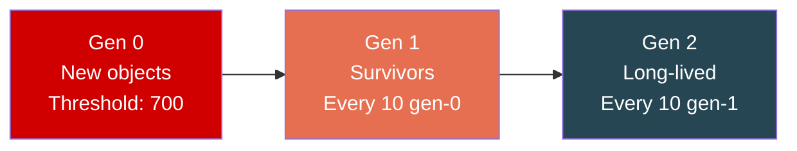
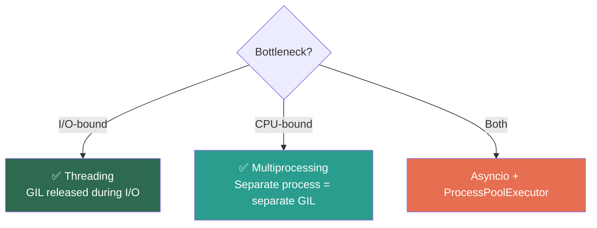

# Python — Phase 3: Under the Hood (CPython Internals)

> **Modules 11–13** | Compilation & Bytecode → Memory Management → The GIL
> **Goal:** Understand what happens when you hit "Run" — from source code to machine execution.


---

## Module 11: CPython Internals — Compilation & Bytecode

> `[x]` — Completed

### 🔑 Core Idea

Python is **compiled to bytecode**, then **interpreted** by the Python Virtual Machine (PVM). It's not purely interpreted — there's a compilation step, but it produces bytecode (`.pyc`), not machine code.

### 💡 Key Concepts

**Compilation pipeline:**


**Inspecting bytecode:**
```python
import dis
def add(a, b):
    return a + b

dis.dis(add)
#  LOAD_FAST    0 (a)
#  LOAD_FAST    1 (b)
#  BINARY_ADD
#  RETURN_VALUE
```

**`.pyc` files:**
- Stored in `__pycache__/`, keyed by Python version
- Invalidated when source `.py` changes (timestamp or hash check)
- `PYTHONDONTWRITEBYTECODE=1` disables writing

**Peephole optimizer — constant folding:**
```python
x = 24 * 60 * 60    # compiler stores 86400 directly at compile time
s = "hello" * 3     # compiler stores "hellohellohello"
```

### 🧠 Mental Model

Source → Tokens → AST → Bytecode → PVM. The bytecode is a stack-based instruction set. `LOAD` pushes to stack, `BINARY_ADD` pops two and pushes result.

### ⚠️ Don't Forget

- Python compiles on every run if no `.pyc` exists or source changed
- `compile()` built-in lets you compile strings to code objects
- Bytecode is **version-specific** — `.pyc` from 3.10 won't work on 3.12
- Constant folding means `"a" * 1000` is pre-computed but `"a" * 10000` isn't (length limit)

### 🎯 Must-Know for Interview

- Python is compiled to bytecode, not directly interpreted
- `dis` module for bytecode inspection
- `.pyc` caching and invalidation mechanism
- Constant folding at compile time
- Bytecode is stack-based — `LOAD`, `STORE`, `BINARY_OP`, `RETURN`

### 📎 Quick Code Snippet

```python
import dis, sys

def example(x):
    return x * 2 + 1

# Inspect bytecode
dis.dis(example)

# Code object attributes
code = example.__code__
print(code.co_varnames)    # ('x',)
print(code.co_consts)      # (None, 2, 1)
print(code.co_stacksize)   # max stack depth needed
```

---

## Module 12: Memory Management

> `[x]` — Completed

### 🔑 Core Idea

CPython uses **reference counting** as the primary GC mechanism (deterministic, immediate). A **generational garbage collector** handles reference cycles that refcounting can't detect.

### 💡 Key Concepts

**Memory allocator hierarchy:**
```
┌──────────────────────────────────────────┐
│ Layer 3: Object-specific (int/list caches)│
├──────────────────────────────────────────┤
│ Layer 2: pymalloc (≤512 bytes)           │
│  Arena(256KB) → Pool(4KB) → Block(8-512B)│
├──────────────────────────────────────────┤
│ Layer 1: OS malloc (>512 bytes)          │
└──────────────────────────────────────────┘
```

**Reference counting:**
- Every object has `ob_refcnt`
- refcount 0 → **immediately freed** (deterministic!)
- `sys.getrefcount(obj)` returns count + 1 (temp arg ref)

**Generational GC (for cycles):**



| Generation | Contains | Collected when |
|-----------|----------|----------------|
| Gen 0 | New objects | `allocs - deallocs > 700` |
| Gen 1 | Survived 1 collection | Every 10 gen-0 cycles |
| Gen 2 | Long-lived | Every 10 gen-1 cycles |

**Reference cycle problem:**
```python
a = []
b = []
a.append(b)    # a → b
b.append(a)    # b → a  ← CYCLE! refcount never hits 0
# Generational GC detects and breaks this cycle
```

### 🧠 Mental Model

Reference counting = **bouncer at the door** — knows instantly when a VIP leaves (refcount 0 → freed). Generational GC = **security sweep** — periodically walks through and finds circular groups that should be evicted.

### ⚠️ Don't Forget

- **`__del__` is dangerous** — unpredictable timing, can prevent cycle collection (pre-3.4), can resurrect objects
- Use **context managers** for cleanup, not `__del__`
- `weakref.ref()` creates references that don't increment refcount — perfect for caches
- `gc.disable()` only disables cyclic GC — reference counting still works
- `tracemalloc` module for debugging memory leaks

### 🎯 Must-Know for Interview

- Two mechanisms: reference counting (primary) + generational GC (cycles)
- Refcount 0 → immediate deallocation (deterministic)
- Three generations with thresholds (700, 10, 10)
- `__del__` pitfalls — why context managers are preferred
- `weakref` for caches that shouldn't prevent GC
- pymalloc for objects ≤512 bytes, OS malloc for larger

### 📎 Quick Code Snippet

```python
import gc, sys, weakref

# Reference counting
x = [1, 2, 3]
print(sys.getrefcount(x))    # 2 (x + arg to getrefcount)

# Force GC
gc.collect()                  # returns number of unreachable objects found
gc.get_threshold()            # (700, 10, 10)

# Weak references (don't prevent GC)
class Cache: pass
obj = Cache()
weak = weakref.ref(obj)
print(weak())                 # <Cache object>
del obj
print(weak())                 # None — GC'd

# Debug memory
import tracemalloc
tracemalloc.start()
# ... your code ...
snapshot = tracemalloc.take_snapshot()
for stat in snapshot.statistics('lineno')[:5]:
    print(stat)
```

---

## Module 13: The GIL (Global Interpreter Lock)

> `[x]` — Completed

### 🔑 Core Idea

The GIL is a **mutex** that allows only one thread to execute Python bytecode at a time. It exists because CPython's reference counting is not thread-safe. It prevents CPU-bound parallelism with threads, but I/O-bound threading works fine because the GIL is released during I/O.

### 💡 Key Concepts

**GIL timeline:**
```
Thread 1:  ████░░░░████░░░░████
Thread 2:  ░░░░████░░░░████░░░░
               ↑ switch every 5ms (sys.getswitchinterval())
```

**What GIL does and does NOT protect:**

| GIL Protects ✅ | GIL Does NOT Protect ❌ |
|---|---|
| CPython internals (refcount, allocator) | Your data structures |
| Single bytecode instruction atomicity | Multi-instruction operations (`counter += 1`) |
| | Logical atomicity of your code |

**When GIL is released:**
- I/O operations (file, network, `time.sleep`)
- C extension calls (numpy, DB drivers)
- `Py_BEGIN_ALLOW_THREADS` in C API

**The decision framework:**



### 🧠 Mental Model

GIL = **one-microphone room**. Only one person (thread) can speak (execute bytecode) at a time. But when someone leaves to grab food (I/O), the microphone is free for others.

### ⚠️ Don't Forget

- **`counter += 1` is NOT thread-safe** even with GIL — it's LOAD_FAST → BINARY_ADD → STORE_FAST (3 instructions, GIL can switch between them)
- GIL makes **CPython internals** safe, not **your code**
- Threading works for I/O-bound tasks (GIL released during I/O)
- For CPU-bound parallelism → `multiprocessing` (each process has its own GIL)
- PEP 703 (Python 3.13+): experimental `--disable-gil` free-threaded mode

### 🎯 Must-Know for Interview

- GIL = mutex protecting CPython's refcount from concurrent corruption
- One thread executes bytecode at a time, switches every 5ms
- I/O-bound → threading works (GIL released). CPU-bound → multiprocessing.
- `counter += 1` is NOT atomic — 3 bytecode instructions, needs explicit `Lock`
- PEP 703 free-threaded Python — awareness of the direction

### 📎 Quick Code Snippet

```python
import sys, threading

# GIL switch interval
print(sys.getswitchinterval())    # 0.005 (5ms)

# += is NOT atomic — race condition demo
counter = 0
lock = threading.Lock()

def increment():
    global counter
    for _ in range(1_000_000):
        with lock:              # MUST lock — += is not atomic!
            counter += 1

t1 = threading.Thread(target=increment)
t2 = threading.Thread(target=increment)
t1.start(); t2.start()
t1.join(); t2.join()
print(counter)    # 2000000 (correct with lock, wrong without)
```

---

## Phase 3 — Interview Quick-Fire

- **"Is Python interpreted or compiled?"** → Both. Compiled to bytecode, then interpreted by PVM. Not purely interpreted.
- **"What's a .pyc file?"** → Cached bytecode. Lives in `__pycache__/`. Invalidated when source changes.
- **"How does Python manage memory?"** → Reference counting (primary, deterministic) + generational GC (for cycles). Three generations: 0, 1, 2.
- **"What is the GIL?"** → Mutex that allows only one thread to execute bytecode. Protects CPython internals (refcount). Released during I/O.
- **"Is `counter += 1` thread-safe?"** → NO. Compiles to 3 bytecode instructions. GIL can switch between them. Use `Lock`.
- **"How to do CPU-bound parallelism?"** → `multiprocessing`. Each process has its own GIL.
- **"What's `__del__` for?"** → Finalizer, but timing is unpredictable. Use context managers instead.
- **"weakref use case?"** → Caches that shouldn't prevent GC. `weakref.WeakValueDictionary`.
- **"Memory leak in Python?"** → Reference cycles with `__del__` (pre-3.4), C extensions, global caches that grow unbounded, closures capturing large objects.

---

## Phase 3 — Key Gotchas Rapid Fire

1. Python is compiled (to bytecode), not purely interpreted
2. `.pyc` is version-specific — 3.10 bytecode doesn't work on 3.12
3. Constant folding: `24 * 60 * 60` computed at compile time
4. `__del__` timing is unpredictable — use context managers
5. Reference counting is deterministic (refcount 0 → immediate free)
6. Generational GC only handles cycles — refcounting does the heavy lifting
7. `gc.disable()` disables cyclic GC only — refcounting still works
8. GIL protects CPython internals, NOT your data structures
9. `counter += 1` is NOT atomic — 3 bytecode ops, needs Lock
10. I/O-bound → threading works. CPU-bound → multiprocessing.
11. PEP 703 free-threaded Python exists but not production-ready
12. pymalloc handles objects ≤512 bytes, OS malloc for larger
