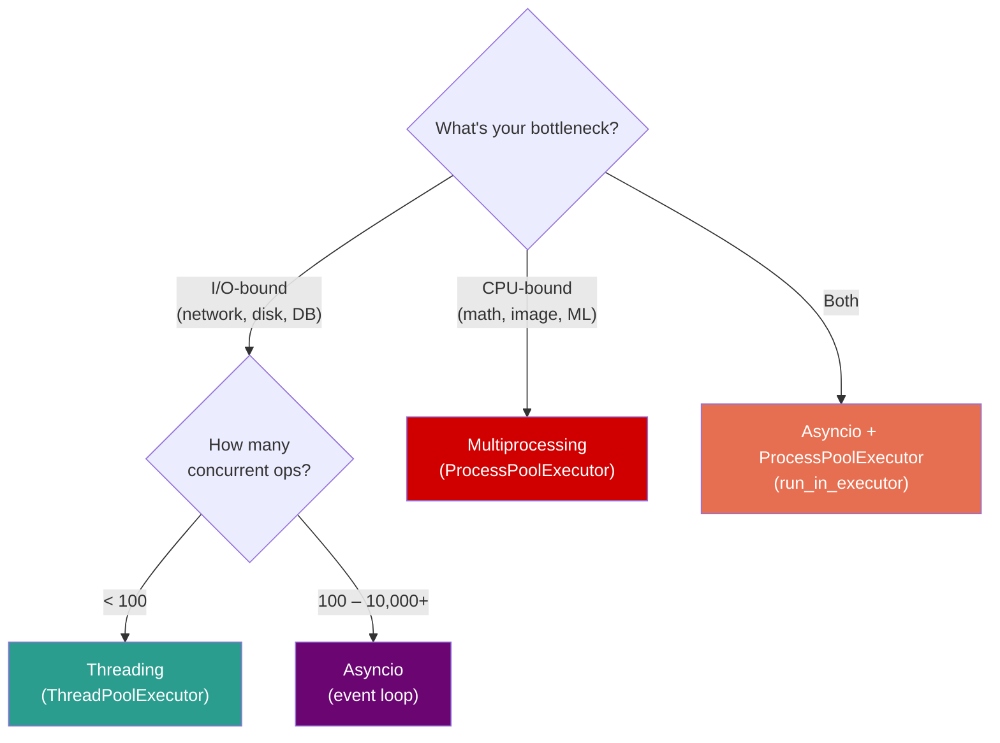

# Python — Phase 4: Concurrency & Parallelism

> **Modules 14–16** | Threading → Multiprocessing → Asyncio
> **Goal:** Know exactly which concurrency tool to reach for — and why.


---

## Module 14: Threading

> `[x]` — Completed

### 🔑 Core Idea

Threading provides **concurrency for I/O-bound** tasks. The GIL is released during I/O, so threads actually run in parallel for network/disk operations. For CPU-bound work, threads are useless (GIL blocks).

### 💡 Key Concepts

**Modern API: `ThreadPoolExecutor`**
```python
from concurrent.futures import ThreadPoolExecutor

with ThreadPoolExecutor(max_workers=10) as pool:
    results = list(pool.map(requests.get, urls))
    # or: futures = [pool.submit(fetch, url) for url in urls]
    #     results = [f.result() for f in futures]
```

**Thread safety primitives:**

| Primitive | Purpose | Example |
|-----------|---------|---------|
| `Lock` | Mutual exclusion | Protecting `counter += 1` |
| `RLock` | Reentrant (same thread re-acquires) | Recursive locking |
| `Semaphore(n)` | Limit to N concurrent threads | Connection pools |
| `Event` | One-time signal | Shutdown flag |
| `Condition` | Wait until notified | Producer-consumer |

### 🧠 Mental Model

Threads = multiple workers in ONE office (shared memory) taking turns using ONE phone (GIL). When a worker is on hold (I/O), another grabs the phone.

### ⚠️ Don't Forget

- `counter += 1` is NOT thread-safe — needs `Lock`
- Daemon threads are killed on main exit — no cleanup guaranteed
- `ThreadPoolExecutor` handles thread lifecycle — prefer over manual `threading.Thread`
- Thread stack ~8MB — 1000 threads = 8GB just in stacks
- **Race condition** = two threads read-modify-write same data without locking

### 🎯 Must-Know for Interview

- Threading works for I/O-bound (GIL released during I/O)
- `ThreadPoolExecutor` is the modern API
- `Lock` for mutual exclusion, `Semaphore` for rate limiting
- `+=` is not atomic — always lock shared mutable state
- Daemon threads for fire-and-forget background tasks

### 📎 Quick Code Snippet

```python
from concurrent.futures import ThreadPoolExecutor, as_completed

def fetch(url):
    return requests.get(url).status_code

with ThreadPoolExecutor(max_workers=20) as pool:
    futures = {pool.submit(fetch, url): url for url in urls}
    for future in as_completed(futures):
        url = futures[future]
        print(f"{url}: {future.result()}")
```

---

## Module 15: Multiprocessing

> `[x]` — Completed

### 🔑 Core Idea

Multiprocessing achieves **true CPU parallelism** by spawning separate processes, each with its own Python interpreter and GIL. Use for CPU-bound work (math, image processing, ML).

### 💡 Key Concepts

**Modern API: `ProcessPoolExecutor`**
```python
from concurrent.futures import ProcessPoolExecutor

def cpu_intensive(n):
    return sum(i**2 for i in range(n))

with ProcessPoolExecutor(max_workers=4) as pool:
    results = list(pool.map(cpu_intensive, [10**6]*4))
```

**`fork` vs `spawn`:**

| | `fork` (Linux default) | `spawn` (Windows/macOS 3.14+ default) |
|---|---|---|
| Speed | Fast (copy-on-write) | Slow (new interpreter) |
| Safety | ❌ Copies lock states, unsafe with threads | ✅ Clean start |
| Rule | **Never fork a multithreaded process** | Always safe |

**IPC mechanisms:**

| Mechanism | Use case | Speed |
|-----------|----------|-------|
| `Queue` | Producer-consumer | Medium |
| `Pipe` | Two-process channel | Fast |
| `Value`/`Array` | Shared memory (ctypes) | Fastest |
| `Manager` | Shared Python objects | Slowest (proxy) |

### 🧠 Mental Model

Processes = separate offices with separate phones. True parallelism, but passing documents between offices (IPC) is expensive because everything must be photocopied (pickled/serialized).

### ⚠️ Don't Forget

- **`if __name__ == '__main__'` guard is mandatory** on Windows/macOS (spawn). Without it → recursive spawn → fork bomb
- Everything sent to/from processes must be **picklable** — no lambdas, no local functions, no open files
- Each process = separate memory space (~30MB overhead) — don't spawn thousands
- `fork` + threads = deadlocks (forked process inherits locked mutexes)
- Serialization overhead can negate parallelism for small tasks

### 🎯 Must-Know for Interview

- Multiprocessing for CPU-bound parallelism (each process = own GIL)
- `ProcessPoolExecutor` is the modern API
- `fork` vs `spawn` — safety trade-offs
- Pickling requirement for IPC
- `if __name__ == '__main__'` guard — why it's needed

### 📎 Quick Code Snippet

```python
from concurrent.futures import ProcessPoolExecutor
import multiprocessing

# Set start method (do once, at top of script)
multiprocessing.set_start_method("spawn")  # safe default

def heavy_compute(data):
    return sum(x**2 for x in data)

if __name__ == '__main__':    # MANDATORY guard
    chunks = [range(i*10**6, (i+1)*10**6) for i in range(4)]
    with ProcessPoolExecutor(max_workers=4) as pool:
        results = list(pool.map(heavy_compute, chunks))
    print(sum(results))
```

---

## Module 16: Asyncio

> `[x]` — Completed

### 🔑 Core Idea

Asyncio provides **cooperative concurrency** on a single thread using an event loop. Coroutines voluntarily yield control at `await` points. Best for high-concurrency I/O (1000s of simultaneous network connections) with minimal memory overhead (~1KB per coroutine vs ~8MB per thread).

### 💡 Key Concepts

**Core mechanics:**
```python
import asyncio

async def fetch_data(url):           # coroutine (not a regular function)
    async with aiohttp.ClientSession() as session:
        async with session.get(url) as resp:
            return await resp.json()  # suspends here, event loop runs others

async def main():
    tasks = [fetch_data(url) for url in urls]
    results = await asyncio.gather(*tasks)  # run all concurrently

asyncio.run(main())                  # entry point — creates event loop
```

**Key APIs:**

| API | Purpose |
|-----|---------|
| `asyncio.run(coro)` | Entry point — runs event loop |
| `await coro` | Suspend and wait for result |
| `asyncio.gather(*coros)` | Run multiple coroutines concurrently |
| `asyncio.create_task(coro)` | Schedule coroutine in background |
| `asyncio.to_thread(func)` | Run blocking code in thread (3.9+) |
| `asyncio.Semaphore(n)` | Limit concurrent coroutines |

### 🧠 Mental Model

Asyncio = **one waiter serving 1000 tables**. The waiter never stands idle — while one table is deciding their order (I/O wait), the waiter serves another. But if the waiter stops to cook a meal (CPU work), ALL tables wait.

### ⚠️ Don't Forget

- **Blocking calls in async = entire event loop freezes** — `time.sleep()`, `requests.get()`, CPU work
- Fix: `await asyncio.to_thread(blocking_func)` or use async-native libraries (`aiohttp`, `asyncpg`)
- `asyncio.gather()` returns results in same order as input (not completion order)
- Coroutines do nothing until `await`ed or wrapped in `create_task()`
- You cannot `await` inside a regular (non-async) function

### 🎯 Must-Know for Interview

- Asyncio = cooperative, single-threaded, event-loop-based concurrency
- Best for I/O-bound with high concurrency (100–10,000+ connections)
- `await` = yield control to event loop (suspension point)
- Never use blocking I/O in async code — use `to_thread()` or async libraries
- ~1KB per coroutine vs ~8MB per thread — scales to millions

### 📎 Quick Code Snippet

```python
import asyncio
import aiohttp

async def fetch(session, url):
    async with session.get(url) as resp:
        return await resp.json()

async def main():
    # Rate-limit to 50 concurrent requests
    semaphore = asyncio.Semaphore(50)
    
    async def limited_fetch(session, url):
        async with semaphore:
            return await fetch(session, url)
    
    async with aiohttp.ClientSession() as session:
        tasks = [limited_fetch(session, url) for url in urls]
        return await asyncio.gather(*tasks)

results = asyncio.run(main())
```

---

## Concurrency Decision Framework



### Comparison Table

| Dimension | Threading | Multiprocessing | Asyncio |
|-----------|-----------|-----------------|---------|
| Concurrency type | Preemptive | True parallel | Cooperative |
| GIL impact | Blocked for CPU | No issue (own GIL) | N/A (single thread) |
| Memory per task | ~8 MB | ~30 MB | **~1 KB** |
| Best for | I/O, <100 tasks | CPU-bound | I/O, 100–10K+ tasks |
| Context switch | OS-controlled | OS-controlled | `await` (you control) |
| Shared state | Shared (need locks) | Separate (need IPC) | Shared (no locks needed*) |
| Debugging | Hard (race conditions) | Medium | Easier (deterministic) |

*Single-threaded asyncio doesn't need locks for shared state — no preemption between `await` points.

---

## Phase 4 — Interview Quick-Fire

- **"Threading vs multiprocessing?"** → Threading for I/O-bound (GIL released during I/O). Multiprocessing for CPU-bound (separate GILs).
- **"When asyncio over threading?"** → High-concurrency I/O (100+ connections). 1KB/coroutine vs 8MB/thread.
- **"Is `counter += 1` thread-safe?"** → No. 3 bytecode instructions. GIL can switch between them. Use Lock.
- **"What happens if you `time.sleep()` in async?"** → Blocks entire event loop. All coroutines freeze. Use `await asyncio.sleep()`.
- **"fork vs spawn?"** → fork is fast but unsafe with threads (copies locked mutexes). spawn is safe but slow.
- **"Why `if __name__ == '__main__'`?"** → spawn re-imports module. Without guard → infinite recursive spawning.
- **"Can asyncio use multiple CPU cores?"** → Not alone. Combine with `ProcessPoolExecutor` via `loop.run_in_executor()`.

---

## Phase 4 — Key Gotchas Rapid Fire

1. `counter += 1` is NOT atomic — 3 bytecode ops, needs Lock
2. Daemon threads killed on exit — no cleanup
3. Thread stack = ~8MB — 1000 threads = 8GB
4. `fork` + threads = deadlocks — never fork multithreaded process
5. Everything to multiprocessing must be picklable — no lambdas
6. `if __name__ == '__main__'` guard is mandatory for spawn
7. Blocking calls in async = event loop freeze — use `to_thread()`
8. `asyncio.gather()` preserves input order, not completion order
9. Coroutines do nothing until `await`ed or `create_task()`'d
10. Asyncio doesn't need locks for shared state (single thread, cooperative)
