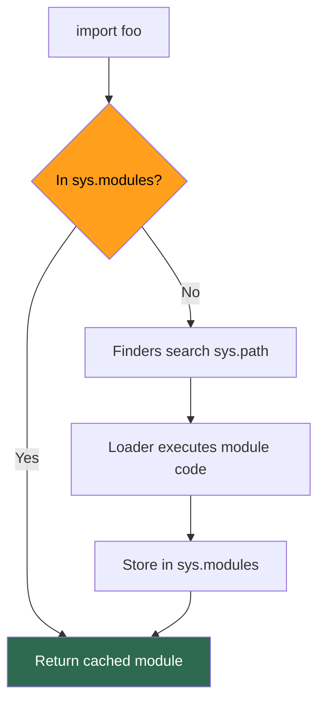
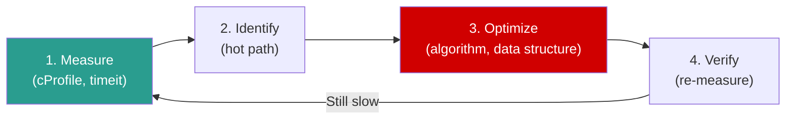

# Python — Phase 5: Production Python

> **Modules 17–20** | Modules & Imports → Type Hints → Testing → Performance & Profiling
> **Goal:** Write Python that ships, scales, and survives production.


---

## Module 17: Modules, Packages & Imports

> `[x]` — Completed

### 🔑 Core Idea

Python's import system is a **module finder + loader pipeline**. Every import is cached in `sys.modules`. Understanding this prevents circular import hell and explains `__init__.py`.

### 💡 Key Concepts

**What happens on `import foo`:**



1. Check `sys.modules` cache → if found, return it (no re-execution)
2. Search `sys.path` using finders (file system, zip, frozen)
3. Loader executes module code (top-level statements run!)
4. Store module object in `sys.modules`

**Package structure:**
```
mypackage/
├── __init__.py          ← runs on `import mypackage`
├── module_a.py
├── module_b.py
└── subpackage/
    ├── __init__.py
    └── module_c.py
```

**`__init__.py`:**
- Runs when package is first imported
- Can be empty (just marks directory as package)
- Often used for convenience imports: `from mypackage import SomeClass`
- **Namespace packages** (3.3+): no `__init__.py` needed, but explicit is better

**`__all__`:**
```python
# mymodule.py
__all__ = ["public_func", "PublicClass"]  # controls `from mymodule import *`
# Everything else is "private" (by convention, not enforcement)
```

### 🧠 Mental Model

`sys.modules` = **global module cache**. First import executes code and caches. Every subsequent import anywhere in the program returns the cached module object — no re-execution.

### ⚠️ Don't Forget

- **Circular imports:** A imports B, B imports A → `ImportError` or `AttributeError` (partially loaded module)
- Fix circular imports: (1) import at function level, (2) restructure, (3) `TYPE_CHECKING` guard
- `sys.path` determines where Python looks — `""` (cwd) is always first
- **Relative imports** (`from . import sibling`) only work inside packages
- Module code runs **top to bottom on first import** — side effects are real

### 🎯 Must-Know for Interview

- Import checks `sys.modules` first (cached) → finders → loaders → cache
- `__init__.py` marks a directory as a package, runs on first import
- Circular import strategies: function-level import, restructure, `TYPE_CHECKING`
- `__all__` controls `from module import *`
- Relative vs absolute imports — when each is appropriate

### 📎 Quick Code Snippet

```python
import sys

# Check if module is already loaded
print("json" in sys.modules)    # True if already imported

# Reload a module (dev/debugging only)
import importlib
importlib.reload(some_module)

# Circular import fix with TYPE_CHECKING
from __future__ import annotations
from typing import TYPE_CHECKING
if TYPE_CHECKING:
    from other_module import OtherClass  # only runs during type checking, not runtime
```

---

## Module 18: Type Hints & Static Analysis

> `[x]` — Completed

### 🔑 Core Idea

Type hints are **documentation that tools can verify**. They have **ZERO runtime effect** — Python doesn't enforce them. `mypy` (static analyzer) does the enforcement.

### 💡 Key Concepts

**Basic annotations:**
```python
def greet(name: str, times: int = 1) -> str:
    return f"Hello, {name}! " * times

# Collections
from typing import List, Dict, Optional, Tuple, Set

def process(items: list[str]) -> dict[str, int]:     # 3.9+ built-in generics
    return {item: len(item) for item in items}

# Optional = Union with None
def find_user(user_id: int) -> Optional[User]:       # same as User | None (3.10+)
    return db.get(user_id)
```

**Advanced types:**

| Type | Purpose | Example |
|------|---------|---------|
| `Optional[X]` | X or None | `Optional[str]` = `str \| None` |
| `Union[X, Y]` | X or Y | `Union[int, str]` = `int \| str` |
| `Literal["a", "b"]` | Specific values only | `mode: Literal["read", "write"]` |
| `TypeVar` | Generic type parameter | `T = TypeVar("T")` |
| `Protocol` | Structural typing (duck typing) | Interface without inheritance |
| `TypedDict` | Dict with specific keys | API response shapes |
| `@overload` | Multiple signatures | Different return types per input |

**`Protocol` — Structural Typing (Pythonic interfaces):**
```python
from typing import Protocol

class Drawable(Protocol):
    def draw(self) -> None: ...

# Any class with draw() matches — no inheritance needed
class Circle:
    def draw(self) -> None:
        print("○")

def render(obj: Drawable) -> None:   # accepts anything with draw()
    obj.draw()

render(Circle())    # ✅ Circle has draw() → matches Protocol
```

### 🧠 Mental Model

Type hints = **guardrails for your IDE and CI pipeline**, not for the Python runtime. Think of them as "contracts that `mypy` enforces."

### ⚠️ Don't Forget

- **Zero runtime cost** — Python ignores type hints at runtime (unless you use `get_type_hints()`)
- `from __future__ import annotations` makes all annotations strings (lazy evaluation) — avoids forward reference issues
- `TYPE_CHECKING` guard for import-only-at-type-check-time (breaks circular imports)
- `list[str]` works in 3.9+. Before: `List[str]` from `typing`
- `mypy --strict` catches more issues but is noisier

### 🎯 Must-Know for Interview

- Type hints have ZERO runtime effect
- `Optional[X]` = `X | None`
- `Protocol` for structural typing (duck typing with type safety)
- `TypeVar` for generic functions/classes
- `TYPE_CHECKING` for circular import resolution

### 📎 Quick Code Snippet

```python
from typing import TypeVar, Generic

T = TypeVar("T")

class Stack(Generic[T]):
    def __init__(self) -> None:
        self._items: list[T] = []
    
    def push(self, item: T) -> None:
        self._items.append(item)
    
    def pop(self) -> T:
        return self._items.pop()

stack: Stack[int] = Stack()
stack.push(42)       # ✅ mypy: int matches T=int
stack.push("hello")  # ❌ mypy error: str doesn't match int
```

---

## Module 19: Testing

> `[x]` — Completed

### 🔑 Core Idea

`pytest` is the standard. Tests follow the **Arrange-Act-Assert** pattern. Mocking isolates units. Fixtures manage setup/teardown.

### 💡 Key Concepts

**Test structure:**
```python
# test_users.py
def test_create_user():
    # Arrange
    user_data = {"name": "Alice", "email": "alice@test.com"}
    
    # Act
    user = create_user(user_data)
    
    # Assert
    assert user.name == "Alice"
    assert user.email == "alice@test.com"
```

**Fixtures:**
```python
import pytest

@pytest.fixture
def db_connection():
    conn = create_connection()     # setup
    yield conn                     # provide to test
    conn.close()                   # teardown (runs even on failure)

@pytest.fixture(scope="module")    # shared across all tests in module
def expensive_resource():
    return load_large_dataset()

def test_query(db_connection):     # fixture injected by name
    result = db_connection.execute("SELECT 1")
    assert result == 1
```

**Fixture scopes:** `function` (default) → `class` → `module` → `session`

**Parametrize:**
```python
@pytest.mark.parametrize("input,expected", [
    ("hello", 5),
    ("", 0),
    ("世界", 2),
])
def test_string_length(input, expected):
    assert len(input) == expected
```

**Mocking:**
```python
from unittest.mock import patch, MagicMock

# Mock WHERE IT'S IMPORTED, not where it's defined
@patch("myapp.services.requests.get")    # not "requests.get"!
def test_fetch_data(mock_get):
    mock_get.return_value.json.return_value = {"status": "ok"}
    
    result = fetch_data("http://api.example.com")
    
    assert result == {"status": "ok"}
    mock_get.assert_called_once_with("http://api.example.com")
```

### 🧠 Mental Model

**Test pyramid:**
```
         /  E2E  \         ← Few, slow, expensive
        / Integration \     ← Some, moderate speed
       /    Unit Tests   \  ← Many, fast, cheap
```

### ⚠️ Don't Forget

- **Mock where it's imported, not where it's defined** — `patch("myapp.module.requests")` not `patch("requests")`
- Fixtures with `yield` handle cleanup — even on test failures
- `conftest.py` shares fixtures across multiple test files (no import needed)
- `monkeypatch` (pytest built-in) is simpler than `mock.patch` for env vars and attributes
- `pytest.raises(ExceptionType)` for testing expected exceptions

### 🎯 Must-Know for Interview

- Arrange-Act-Assert pattern
- Fixture scopes and `yield` for teardown
- Mock where it's imported (not defined)
- `parametrize` for data-driven tests
- Test pyramid: unit → integration → e2e

### 📎 Quick Code Snippet

```python
# conftest.py — shared fixtures
import pytest

@pytest.fixture(scope="session")
def api_client():
    client = TestClient(app)
    yield client

# test_api.py
def test_health(api_client):
    resp = api_client.get("/health")
    assert resp.status_code == 200

# Testing exceptions
def test_invalid_input():
    with pytest.raises(ValueError, match="must be positive"):
        calculate(-1)
```

---

## Module 20: Performance & Profiling

> `[x]` — Completed

### 🔑 Core Idea

**Measure first, optimize second.** Never guess where bottlenecks are — profile, identify the hot path, optimize it, then verify the improvement.

### 💡 Key Concepts

**Profiling workflow:**



**Profiling tools:**

| Tool | Measures | Use for |
|------|----------|---------|
| `timeit` | Execution time of snippets | Micro-benchmarks |
| `cProfile` | Function call counts & time | Finding slow functions |
| `line_profiler` | Per-line execution time | Hot-path line analysis |
| `tracemalloc` | Memory allocations | Finding memory leaks |
| `memory_profiler` | Per-line memory usage | Memory optimization |

```python
# timeit — micro-benchmark
import timeit
timeit.timeit('"-".join(str(i) for i in range(100))', number=10000)

# cProfile — function-level profiling
import cProfile
cProfile.run('main()')
# or: python -m cProfile -s cumulative script.py

# tracemalloc — memory debugging
import tracemalloc
tracemalloc.start()
# ... code ...
snapshot = tracemalloc.take_snapshot()
for stat in snapshot.statistics("lineno")[:10]:
    print(stat)
```

**Common optimization patterns:**

| Anti-pattern | Fix | Speedup |
|-------------|-----|---------|
| `str += str` in loop | `"".join(list)` | O(n²) → O(n) |
| `if x in list` (large) | `if x in set` | O(n) → O(1) |
| Recomputing same values | `@lru_cache` | Depends on overlap |
| Creating objects in loop | Pre-allocate / `__slots__` | Reduce GC pressure |
| `list.insert(0)` | `collections.deque` | O(n) → O(1) |
| Global variable access | Local variable in hot loop | ~20% faster |

```python
# Local variable optimization (obscure but real)
def slow():
    for i in range(10_000_000):
        len([1,2,3])           # global lookup of 'len' each iteration

def fast():
    _len = len                  # cache in local variable
    for i in range(10_000_000):
        _len([1,2,3])          # local lookup (~20% faster)
```

### 🧠 Mental Model

**Optimization hierarchy:** Algorithm (O(n²)→O(n)) → Data structure (list→set) → Python-level (join, slots) → C extension (numpy, Cython) → Give up and use Go.

### ⚠️ Don't Forget

- **Premature optimization is the root of all evil** — profile first
- `timeit` disables GC by default — may not reflect real-world performance
- `__slots__` saves memory but doesn't speed up attribute access significantly
- String formatting: f-strings > `.format()` > `%` (speed AND readability)
- List comprehensions are faster than `map()` + `lambda` (in CPython)

### 🎯 Must-Know for Interview

- Profiling workflow: measure → identify → optimize → verify
- `cProfile` for function-level, `line_profiler` for line-level
- `tracemalloc` for memory leak debugging
- Common O(n²)→O(n) patterns (string concat, list membership)
- `__slots__` for memory optimization of many instances

### 📎 Quick Code Snippet

```python
# Quick profiling
import cProfile
import pstats

with cProfile.Profile() as pr:
    main()

stats = pstats.Stats(pr)
stats.sort_stats("cumulative")
stats.print_stats(20)          # top 20 slowest functions
```

---

## Phase 5 — Interview Quick-Fire

- **"What happens on import?"** → Check `sys.modules` cache → find module on `sys.path` → execute → cache.
- **"Circular import fix?"** → Import at function level, or use `TYPE_CHECKING` guard, or restructure.
- **"Do type hints affect runtime?"** → No. Zero runtime effect. Only `mypy` and IDE use them.
- **"`Optional[str]` meaning?"** → `str | None`. The value can be a string or None.
- **"Mock where?"** → Where it's **imported**, not where it's defined.
- **"Fixture scope?"** → function (default) → class → module → session. `yield` for teardown.
- **"How to find slow code?"** → `cProfile` first (function-level), then `line_profiler` on hot functions.
- **"String concat in loop?"** → O(n²). Use `"".join()` → O(n).
- **"`Protocol` vs ABC?"** → Protocol = structural typing (duck typing). ABC = nominal typing (must inherit).

---

## Phase 5 — Key Gotchas Rapid Fire

1. `sys.modules` caches modules — second import doesn't re-execute code
2. Module top-level code runs on first import — side effects are real
3. Type hints have ZERO runtime cost — Python ignores them
4. `Optional[X]` ≠ "argument is optional" — it means "X or None"
5. Mock where it's imported, not where it's defined
6. `conftest.py` fixtures are auto-discovered — no import needed
7. `timeit` disables GC by default — may give misleading results
8. f-strings are fastest formatting method
9. List comprehensions faster than `map()` + `lambda` in CPython
10. `cProfile` overhead can distort results for very fast functions — use `timeit` for micro-benchmarks
