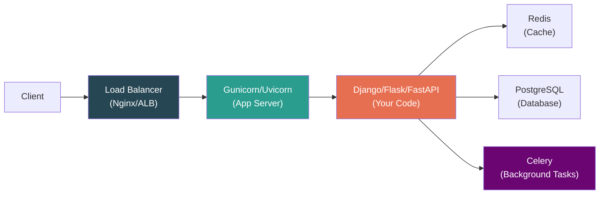
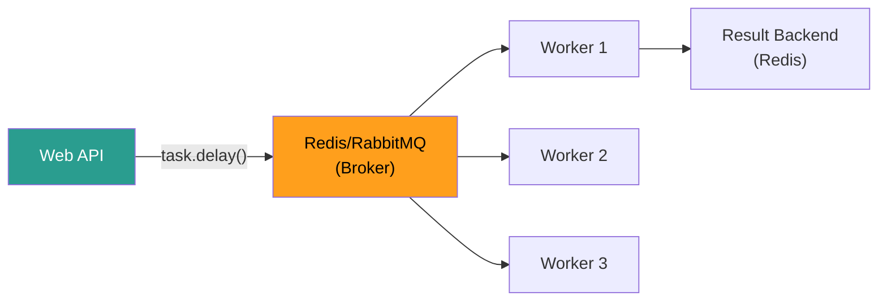
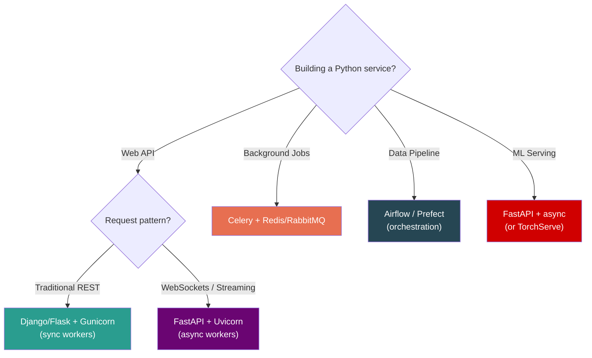

# Python — Phase 6: Design & Architecture

> **Modules 21–22** | Design Patterns → Python in System Design Interviews
> **Goal:** Think like a senior — patterns, trade-offs, and production-scale Python architecture.


---

## Module 21: Design Patterns in Python

> `[x]` — Completed

### 🔑 Core Idea

Python needs **fewer design patterns** than Java/C++ because first-class functions, duck typing, and dynamic features replace many classical patterns. The Pythonic way is simpler.

### 💡 Key Concepts

**Java Pattern → Pythonic Equivalent:**

| Pattern | Java Way | Python Way |
|---------|----------|------------|
| **Strategy** | Interface + classes | Pass a function |
| **Observer** | Interface + register | Callbacks or signals |
| **Singleton** | Private constructor | Module-level instance |
| **Factory** | Factory class | Function or `__init_subclass__` |
| **Iterator** | Iterator class | Generator function |
| **Decorator** | Wrapper class | `@decorator` function |
| **Template Method** | Abstract class | Function with callback parameter |

**Singleton — Three Ways:**

```python
# Way 1: Module-level (BEST — Python modules are singletons)
# config.py
_settings = None
def get_settings():
    global _settings
    if _settings is None:
        _settings = load_settings()
    return _settings

# Way 2: __new__ override
class Singleton:
    _instance = None
    def __new__(cls):
        if cls._instance is None:
            cls._instance = super().__new__(cls)
        return cls._instance

# Way 3: Class decorator (from Module 7)
@singleton
class Database: pass
```

> **Best practice:** Module-level singleton. Python modules are only executed once and cached in `sys.modules`. A module IS a singleton.

**Registry / Plugin Pattern:**

```python
# Auto-registration using __init_subclass__
class Handler:
    _registry = {}
    
    def __init_subclass__(cls, **kwargs):
        super().__init_subclass__(**kwargs)
        Handler._registry[cls.__name__.lower()] = cls

class JsonHandler(Handler): pass
class XmlHandler(Handler): pass

print(Handler._registry)
# {'jsonhandler': JsonHandler, 'xmlhandler': XmlHandler}
# New handlers auto-register just by subclassing!
```

**Strategy Pattern — The Pythonic Way:**

```python
# Java way: Strategy interface + ConcreteStrategy classes → overkill

# Python way: just pass a function
def process_data(data, transform_fn):
    return [transform_fn(item) for item in data]

process_data(data, str.upper)           # strategy 1
process_data(data, lambda x: x[:10])    # strategy 2
process_data(data, custom_transform)    # strategy 3
```

**Context Manager as Resource Pattern:**
```python
# Instead of Factory + cleanup patterns:
@contextmanager
def managed_connection(url):
    conn = create_connection(url)
    try:
        yield conn
    finally:
        conn.close()

with managed_connection("postgres://...") as conn:
    conn.execute("SELECT 1")
# Connection guaranteed closed — no manual cleanup
```

### 🧠 Mental Model

In Python: **functions replace classes, modules replace singletons, generators replace iterators, `with` replaces try/finally.** If you're writing a Java pattern in Python, there's probably a simpler way.

### ⚠️ Don't Forget

- Module-level singleton > class-based singleton (simpler, idiomatic)
- `__init_subclass__` for plugin/registry patterns (3.6+)
- First-class functions eliminate Strategy, Command, and Template Method patterns
- Don't over-engineer — Python's dynamic nature makes many OOP patterns unnecessary
- `dataclasses` replace Builder pattern for simple data containers

### 🎯 Must-Know for Interview

- Know the Pythonic alternative to classical patterns (Strategy → function, Singleton → module)
- Registry pattern with `__init_subclass__`
- Context manager for resource management (replaces RAII)
- `dataclasses.dataclass` for structured data (replaces Builder/DTO patterns)
- "Python needs fewer patterns because of first-class functions and duck typing"

### 📎 Quick Code Snippet

```python
from dataclasses import dataclass, field

@dataclass
class Config:
    host: str
    port: int = 8080
    tags: list[str] = field(default_factory=list)
    
    def __post_init__(self):
        if self.port < 0:
            raise ValueError("Port must be positive")

# Replaces: Builder pattern, __init__ boilerplate, __repr__, __eq__
c = Config("localhost")
print(c)    # Config(host='localhost', port=8080, tags=[])
```

---

## Module 22: Python in System Design Interviews

> `[x]` — Completed

### 🔑 Core Idea

Know how Python services are **deployed, scaled, and architected** in production. Understand the web server stack (WSGI/ASGI), task queues (Celery), and where Python's strengths and limits lie.

### 💡 Key Concepts

**The Python Web Stack:**



**WSGI vs ASGI:**

| | WSGI | ASGI |
|---|---|---|
| Protocol | Synchronous | Async-native |
| Frameworks | Django, Flask | FastAPI, Starlette, Django 3.1+ |
| App server | Gunicorn | Uvicorn, Hypercorn |
| WebSockets | ❌ | ✅ |
| Best for | Traditional REST APIs | WebSockets, streaming, high-concurrency I/O |

**Gunicorn Worker Models:**

| Worker | Type | Use when |
|--------|------|----------|
| `sync` | One request per worker (process) | Simple APIs, CPU-bound |
| `gthread` | Thread pool per worker | I/O-bound with sync framework |
| `uvicorn.workers.UvicornWorker` | Async event loop | FastAPI/ASGI apps |

```bash
# Production command
gunicorn app:app --workers 4 --worker-class uvicorn.workers.UvicornWorker --bind 0.0.0.0:8000
# workers = (2 × CPU cores) + 1 is the classic formula
```

> **Each Gunicorn worker = separate process = separate GIL.** This is how Python web apps achieve parallelism — multiple processes, not threads.

**Celery — Background Task Processing:**



```python
from celery import Celery

app = Celery("tasks", broker="redis://localhost:6379/0")

@app.task(bind=True, max_retries=3, default_retry_delay=60)
def process_order(self, order_id):
    try:
        result = heavy_computation(order_id)
        return result
    except TransientError as e:
        self.retry(exc=e)
```

**Key Celery design rules:**
- Tasks must be **idempotent** (safe to retry)
- Task arguments must be **JSON-serializable** (no Python objects)
- Use **result backends** sparingly — they add overhead
- Set `task_acks_late=True` for at-least-once delivery
- Use `task_time_limit` to prevent stuck workers

**Connection Pooling:**
```python
# Without pooling: new DB connection per request → 100ms overhead
# With pooling: reuse connections from pool → ~0ms overhead

# SQLAlchemy
engine = create_engine(
    "postgresql://...",
    pool_size=20,           # maintain 20 connections
    max_overflow=10,        # allow 10 extra under load
    pool_pre_ping=True,     # verify connections are alive
    pool_recycle=3600,      # recycle after 1 hour
)
```

**When Python Is the Wrong Choice:**

| Requirement | Better Alternative | Why |
|-------------|-------------------|-----|
| Sub-millisecond latency | Go, Rust, C++ | GIL, interpreter overhead |
| Heavy CPU computation | C extension, Rust, Go | GIL, no true threading |
| Mobile/embedded | Swift, Kotlin, C | Runtime size, performance |
| Browser front-end | JavaScript/TypeScript | Obviously |

**When Python Is the Right Choice:**

| Requirement | Why Python Wins |
|-------------|----------------|
| Rapid prototyping | Fastest development speed |
| Data/ML pipelines | NumPy, Pandas, PyTorch ecosystem |
| Automation/scripting | Batteries included, readable |
| Web APIs (moderate scale) | Django/FastAPI + Celery |
| Glue code between services | Easy integration, great libraries |

### 🧠 Mental Model

Python web architecture = **multiple processes** (Gunicorn workers), each handling requests with their own GIL. Background work goes to **Celery workers** (also separate processes). Redis acts as cache + message broker. The GIL is irrelevant because parallelism is at the process level.

### ⚠️ Don't Forget

- **Gunicorn workers = processes**, not threads. Formula: `(2 × CPU) + 1`
- Each request in sync worker blocks that worker → need enough workers
- FastAPI + Uvicorn for async workloads (WebSockets, streaming)
- Celery tasks must be idempotent and JSON-serializable
- Connection pooling is mandatory in production (DB, Redis, HTTP)
- Python's strength is ecosystem and dev speed, not raw performance

### 🎯 Must-Know for Interview

- WSGI (sync) vs ASGI (async) — which frameworks use which
- Gunicorn workers = processes, each with own GIL
- Celery for background tasks — broker (Redis) → workers → result backend
- Connection pooling (SQLAlchemy `pool_size`, Redis `ConnectionPool`)
- When to choose Python vs Go/Rust/Java — honest trade-offs
- Worker formula: `(2 × CPU cores) + 1`

### 📎 Quick Code Snippet

```python
# FastAPI + async — production-grade API
from fastapi import FastAPI, BackgroundTasks
import asyncio

app = FastAPI()

@app.get("/users/{user_id}")
async def get_user(user_id: int):
    user = await db.fetch_user(user_id)     # async DB call
    return {"user": user}

@app.post("/orders")
async def create_order(order: OrderSchema, bg: BackgroundTasks):
    result = await db.insert_order(order)
    bg.add_task(send_confirmation_email, order.email)  # non-blocking
    return {"order_id": result.id}
```

---

## Python System Design Decision Framework



---

## Phase 6 — Interview Quick-Fire

- **"How does Python handle web concurrency?"** → Multiple Gunicorn worker processes, each with own GIL. Workers = (2 × CPU) + 1.
- **"WSGI vs ASGI?"** → WSGI is sync (Django/Flask). ASGI is async (FastAPI). ASGI for WebSockets/streaming.
- **"How to handle background tasks?"** → Celery with Redis/RabbitMQ broker. Tasks must be idempotent.
- **"Singleton in Python?"** → Module-level instance (Python modules are singletons). Don't use Java-style class singletons.
- **"Design patterns in Python?"** → Fewer needed. Functions replace Strategy. Modules replace Singleton. Generators replace Iterator. Decorators replace Proxy.
- **"When NOT to use Python?"** → Sub-ms latency, heavy CPU without C extensions, mobile/embedded.
- **"Connection pooling?"** → Mandatory. SQLAlchemy `pool_size`, Redis `ConnectionPool`. Without it, connection overhead kills performance.
- **"Celery task design?"** → Idempotent, JSON-serializable args, set time limits, use `acks_late` for at-least-once.

---

## Phase 6 — Key Gotchas Rapid Fire

1. Gunicorn workers = processes, NOT threads — each has own GIL
2. Worker formula: `(2 × CPU cores) + 1`
3. Celery tasks must be idempotent — retries happen
4. Celery args must be JSON-serializable — no Python objects
5. Connection pooling is mandatory — 100ms overhead without it
6. Module-level singleton is Pythonic — no need for `__new__` tricks
7. `__init_subclass__` for plugin/registry pattern (auto-registration)
8. First-class functions eliminate half of classical design patterns
9. FastAPI + Uvicorn for async; Django + Gunicorn for sync
10. Python's strength = ecosystem + dev speed, not raw performance

---

## Master Limits & Numbers Table

| Item | Value |
|------|-------|
| Integer cache range | `[-5, 256]` |
| `sys.getrefcount()` overhead | +1 (temporary arg reference) |
| GC generation thresholds | `(700, 10, 10)` |
| GIL switch interval | 5ms (`sys.getswitchinterval()`) |
| pymalloc block size limit | ≤512 bytes |
| pymalloc arena size | 256 KB |
| pymalloc pool size | 4 KB |
| Thread stack size | ~8 MB |
| Process overhead | ~30 MB |
| Coroutine overhead | ~1 KB |
| Dict load factor (resize) | ~2/3 (66%) |
| List over-allocation formula | `old + (old >> 3) + 6` |
| Gunicorn workers formula | `(2 × CPU cores) + 1` |
| `lru_cache` default maxsize | 128 |
| Max recursion depth | ~1000 (`sys.getrecursionlimit()`) |
| `__all__` controls | `from module import *` |
| Bucket policy size (S3 ref) | 20 KB |

---

## Senior-Level Gotchas — All Phases Rapid Fire

1. `is` for values → wrong. Only for `None`, `True`, `False`
2. Integer cache `[-5, 256]` → CPython-specific, never rely on it
3. Mutable default `def f(x=[])` → shared across calls, use `None` sentinel
4. `+=` on list → in-place. `+=` on tuple → new object
5. `del` deletes name, not object
6. Pass-by-object-reference ≠ pass-by-reference (rebind test proves it)
7. `list.pop(0)` → O(n), use `collections.deque`
8. `defaultdict` inserts on read — silent memory bloat
9. String `+=` in loop → O(n²), use `join()`
10. `len(str)` = characters, `len(bytes)` = bytes
11. Generators are single-use — exhausted after one iteration
12. Late binding closures → `lambda i=i: i` fix
13. `@functools.wraps` is non-negotiable for decorators
14. `super()` follows MRO, not parent class
15. Bare `except:` catches `KeyboardInterrupt` — unkillable process
16. `lru_cache` requires hashable args
17. `counter += 1` is NOT thread-safe — 3 bytecode ops
18. GIL protects CPython internals, NOT your code
19. `fork` + threads = deadlocks
20. Mock where it's imported, not where it's defined

---

## Interview Quick-Fire — All Phases

- **"Is Python pass-by-reference?"** → No. Pass-by-object-reference. Mutate=visible, rebind=invisible.
- **"is vs ==?"** → `is` = identity (same `id`), `==` = equality (`__eq__`). Only `is None`.
- **"Are dicts ordered?"** → Yes, insertion-ordered since 3.7 (language guarantee).
- **"What's a closure?"** → Function capturing variables from enclosing scope. Late binding — captures variable, not value.
- **"Iterator vs iterable?"** → Iterable has `__iter__`. Iterator has `__iter__` + `__next__`.
- **"What's the GIL?"** → Mutex allowing one thread to execute bytecode. Released during I/O.
- **"Is `x += 1` thread-safe?"** → No. 3 bytecode ops. Use Lock.
- **"Threading vs multiprocessing?"** → Threading for I/O-bound. Multiprocessing for CPU-bound.
- **"asyncio vs threading?"** → Asyncio for 100+ concurrent I/O tasks (1KB/coroutine vs 8MB/thread).
- **"Type hints affect runtime?"** → No. Zero runtime effect.
- **"Singleton in Python?"** → Module-level instance. Modules are singletons.
- **"How does Python manage memory?"** → Reference counting + generational GC (3 generations).
- **"How to profile Python?"** → `cProfile` for functions, `line_profiler` for lines, `tracemalloc` for memory.
