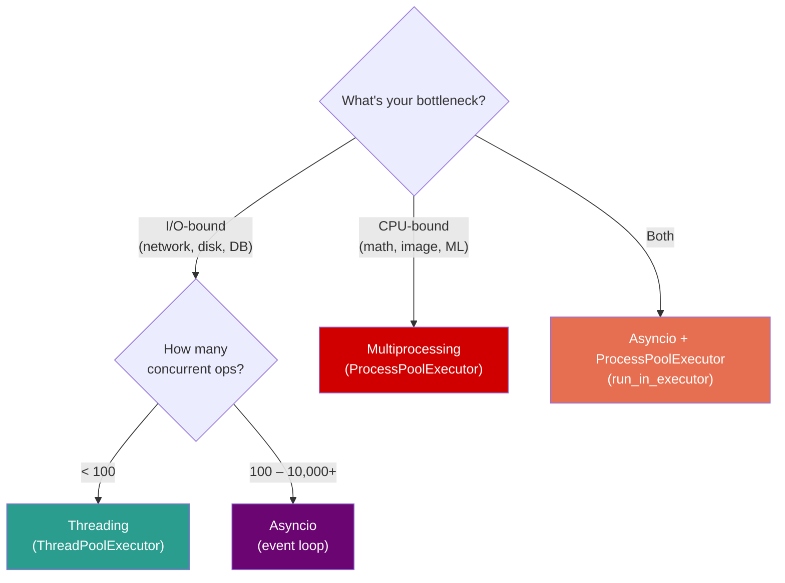

# Python — Phase 4: Concurrency & Parallelism

> **Modules 14–16** | Threading → Multiprocessing → Asyncio
> **Goal:** Know exactly which concurrency tool to reach for — and why.

---

## Module 14: Threading

> `[ ]` — Notes will be filled in as we cover this

### 🔑 Core Idea

*(pending — `threading` module, thread safety, race conditions, locks, deadlocks, `ThreadPoolExecutor`)*

### 💡 Key Concepts

*(pending — `Lock`, `RLock`, `Semaphore`, `Event`, `Condition`, daemon threads, `concurrent.futures`)*

### 🧠 Mental Model

*(pending — thread execution timeline with GIL, lock acquisition diagram)*

### ⚠️ Don't Forget

*(pending — GIL means no CPU parallelism, `+=` not atomic, daemon threads killed on exit)*

### 🎯 Must-Know for Interview

*(pending)*

### 📎 Quick Code Snippet

*(pending)*

---

## Module 15: Multiprocessing

> `[ ]` — Notes will be filled in as we cover this

### 🔑 Core Idea

*(pending — `multiprocessing` module, `ProcessPoolExecutor`, IPC, shared memory, `fork` vs `spawn`)*

### 💡 Key Concepts

*(pending — `Pool`, `Queue`, `Pipe`, `Value`/`Array`, `Manager`, pickling requirements)*

### 🧠 Mental Model

*(pending — process vs thread memory model diagram, IPC channels)*

### ⚠️ Don't Forget

*(pending — fork safety, pickling failures, `if __name__ == '__main__'` guard, serialization overhead)*

### 🎯 Must-Know for Interview

*(pending)*

### 📎 Quick Code Snippet

*(pending)*

---

## Module 16: Asyncio

> `[ ]` — Notes will be filled in as we cover this

### 🔑 Core Idea

*(pending — event loop, coroutines, `async`/`await`, `asyncio.gather`, `aiohttp`, when async > threads)*

### 💡 Key Concepts

*(pending — `Task`, `Future`, `asyncio.create_task`, `asyncio.run`, `Semaphore` for rate limiting)*

### 🧠 Mental Model

*(pending — event loop with cooperative scheduling diagram, coroutine state machine)*

### ⚠️ Don't Forget

*(pending — blocking calls in async = kill performance, `asyncio.to_thread()`, don't mix sync I/O)*

### 🎯 Must-Know for Interview

*(pending)*

### 📎 Quick Code Snippet

*(pending)*

---

## Concurrency Decision Framework

*(Will be filled — Threading vs Multiprocessing vs Asyncio decision tree)*

---

## Phase 4 — Interview Quick-Fire

*(Will be compiled after all 3 modules are covered)*

---

## Phase 4 — Key Gotchas Rapid Fire

*(Will be compiled after all 3 modules are covered)*
