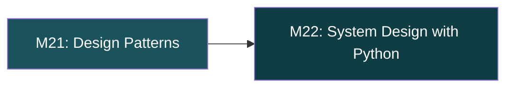
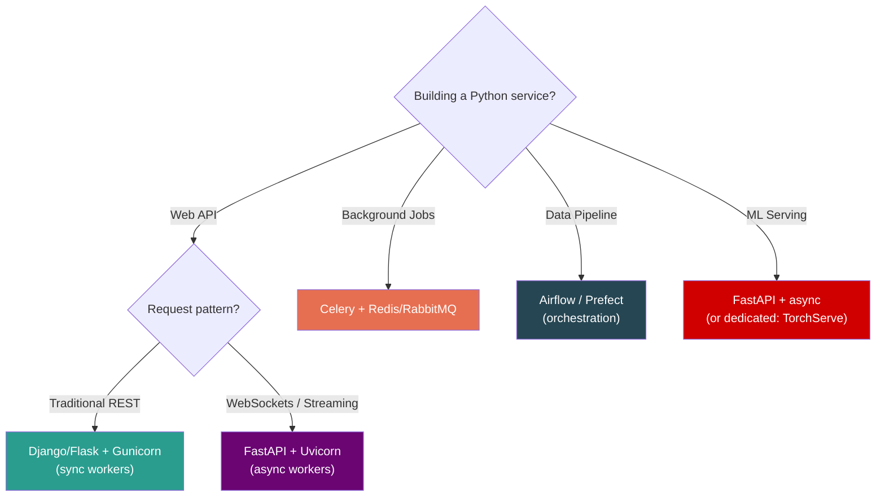

# Python — Phase 6: Design & Architecture

> **Modules 21–22** | Design Patterns → Python in System Design Interviews
> **Goal:** Think like a senior — patterns, trade-offs, and production-scale Python architecture.

---

## Module 21: Design Patterns in Python

> `[ ]` — Notes will be filled in as we cover this

### 🔑 Core Idea

*(pending — Singleton, Factory, Strategy, Observer — the Pythonic way, not the Java way)*

### 💡 Key Concepts

*(pending — why Python needs fewer patterns, using first-class functions instead of Strategy, `__init_subclass__` for plugin registration)*

### 🧠 Mental Model

*(pending — Java pattern → Pythonic equivalent mapping table)*

### ⚠️ Don't Forget

*(pending — module-level singletons > class singletons, `__new__` for singleton, registry pattern)*

### 🎯 Must-Know for Interview

*(pending)*

### 📎 Quick Code Snippet

*(pending)*

---

## Module 22: Python in System Design Interviews

> `[ ]` — Notes will be filled in as we cover this

### 🔑 Core Idea

*(pending — Celery, Redis, Django/Flask internals, WSGI/ASGI, scaling Python services)*

### 💡 Key Concepts

*(pending — WSGI lifecycle, ASGI for WebSockets, Gunicorn worker models, connection pooling, Celery task design)*

### 🧠 Mental Model

*(pending — Python service architecture: Load Balancer → ASGI/WSGI → App → Cache → DB)*

### ⚠️ Don't Forget

*(pending — GIL impact on web servers, Gunicorn workers = processes, async frameworks for I/O-heavy services)*

### 🎯 Must-Know for Interview

*(pending)*

### 📎 Quick Code Snippet

*(pending)*

---

## Python System Design Decision Framework

*(Will be filled — when to use Python vs Go/Java, scaling strategies, common interview patterns)*

---

## Phase 6 — Interview Quick-Fire

*(Will be compiled after all 2 modules are covered)*

---

## Phase 6 — Key Gotchas Rapid Fire

*(Will be compiled after all 2 modules are covered)*

---

## Master Limits & Numbers Table

*(Will be compiled at the very end — all key numbers across all 22 modules)*

---

## Senior-Level Gotchas — Rapid Fire (All Phases)

*(Will be compiled at the very end — the top 20 gotchas from all modules)*

---

## Interview Quick-Fire Answers (All Phases)

*(Will be compiled at the very end — one-liners for the 25 most common Python interview questions)*
