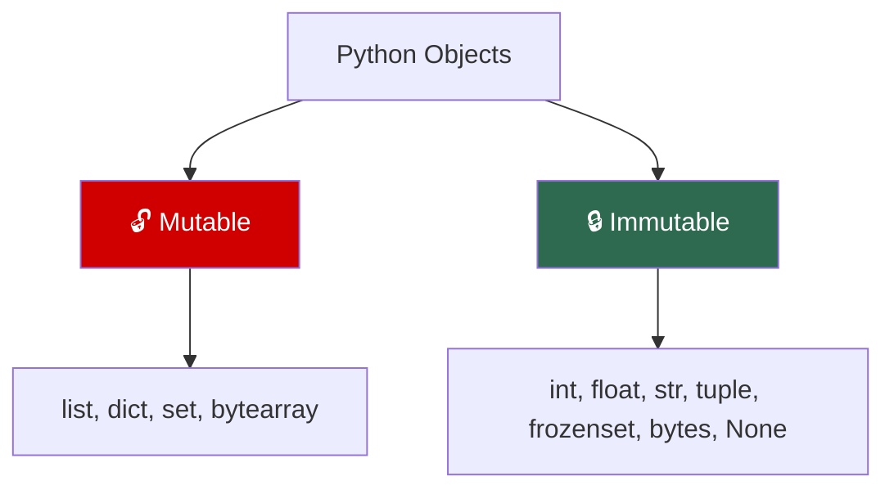

# Python — Phase 1: The Foundation

> **Modules 1–5** | Object Model → Variables & Memory → Data Structures → Strings & Unicode → Functions & Scoping
> **Goal:** Build an unshakable mental model of how Python actually works under the hood.


---

## Module 1: Python Object Model

> `[x]` — Completed

### 🔑 Core Idea

**Everything in Python is an object** — integers, strings, functions, classes, modules, `None`. Every object has exactly three properties:

| Property | What it is | Inspect with |
|----------|-----------|--------------|
| **Identity** | Unique memory address (never changes) | `id(x)` |
| **Type** | What kind of object (never changes) | `type(x)` |
| **Value** | The data (may or may not change) | Just print it |

### 💡 Key Concepts

**`is` vs `==`:**

| Operator | Checks | Under the hood |
|----------|--------|----------------|
| `is` | Identity — same object? | `id(a) == id(b)` |
| `==` | Equality — same value? | `a.__eq__(b)` |

Only use `is` for: `None`, `True`, `False`. Never for value comparisons.

**Integer caching:** CPython pre-caches `[-5, 256]`. Implementation detail — never rely on it.

**Mutability divide:**



| Consequence | Mutable | Immutable |
|-------------|---------|-----------|
| Dict keys / Set members | ❌ Unhashable | ✅ Hashable |
| Thread safety | ⚠️ Needs locks | ✅ Safe |
| Function defaults | ⚠️ Shared trap | ✅ Safe |

### 🧠 Mental Model

Variables = **sticky labels** on boxes in a warehouse. `x = 42` sticks the label "x" on the box containing 42. `y = x` puts a second label on the **same box**. The box never moves.

### ⚠️ Don't Forget

- `type(type)` → `<class 'type'>` — type is an instance of itself
- `None` is a singleton — exactly one instance
- Immutable ≠ constant — you can rebind the variable, you can't change the object
- Tuple with mutable contents = **still unhashable**: `{(1, [2]): "val"}` → `TypeError`

### 🎯 Must-Know for Interview

- Everything is an object → `id()`, `type()`, value
- `is` for identity, `==` for equality, only `is None` for None checks
- Mutable objects can't be dict keys (unhashable)
- Mutable default argument trap → use `None` sentinel

### 📎 Quick Code Snippet

```python
a = [1, 2, 3]
b = a           # same object
b.append(4)
print(a)        # [1, 2, 3, 4] — a sees the change
print(a is b)   # True

# Mutable default trap
def bad(items=[]):
    items.append(1)
    return items
bad()  # [1]
bad()  # [1, 1] ← shared!

# Fix: None sentinel
def good(items=None):
    items = items or []
    items.append(1)
    return items
```

---

## Module 2: Variables & Memory

> `[x]` — Completed

### 🔑 Core Idea

Variables are **name bindings** (labels), not containers. `=` never copies — it only moves a label. Python uses **reference counting** to track object lifetime.

### 💡 Key Concepts

**Reference counting:**
```python
import sys
x = "hello"          # refcount = 1
y = x                # refcount = 2
del x                # refcount = 1
y = None             # refcount = 0 → object destroyed
# sys.getrefcount(obj) always shows +1 (temporary arg reference)
```

**Object interning/caching:**

| Cached | Range | Why |
|--------|-------|-----|
| Small integers | `[-5, 256]` | Extremely common values |
| Strings | Identifier-like | Fast attribute/dict lookups |
| Singletons | `None`, `True`, `False` | One instance ever |

**Shallow vs Deep copy:**

| Method | Copies | Use for |
|--------|--------|---------|
| `=` | Nothing (new label) | Shared state |
| `copy.copy()` / `.copy()` | Top-level only | Flat structures |
| `copy.deepcopy()` | Everything recursively | Nested structures |
| `a[:]` | Shallow (lists only) | Quick list copy |

### 🧠 Mental Model

```
SHALLOW COPY:                          DEEP COPY:
original ──► {"users": ──► [A, B]}     original ──► {"users": ──► [A, B]}
shallow  ──► {"users": ──┘ }           deep     ──► {"users": ──► [A', B']}
(new dict, SAME list)                  (new dict, NEW list, NEW inner dicts)
```

### ⚠️ Don't Forget

- `+=` on mutables mutates in-place; on immutables creates new object
- `del` deletes the **name**, not the object
- Arguments are passed **by object reference** — not by value, not by reference
- Mutate via parameter → caller sees. Rebind parameter → caller doesn't.

```python
def modify(lst):
    lst.append(4)      # caller sees this ✅
def rebind(lst):
    lst = [9, 9, 9]    # caller does NOT see this ❌

a = [1, 2, 3]
modify(a)   # a = [1, 2, 3, 4]
rebind(a)   # a = [1, 2, 3, 4] (unchanged)
```

### 🎯 Must-Know for Interview

- "Python is pass-by-object-reference" — mutate=visible, rebind=invisible
- `sys.getrefcount()` returns count+1
- Integer cache `[-5, 256]` — CPython-specific, never rely on it
- Always use `copy.deepcopy()` for nested structures you need to isolate

### 📎 Quick Code Snippet

```python
import copy
original = {"users": [{"name": "Alice"}]}
shallow = copy.copy(original)
deep = copy.deepcopy(original)

shallow["users"].append({"name": "Bob"})
print(original["users"])  # [Alice, Bob] ← mutated!

deep["users"].append({"name": "Charlie"})
print(original["users"])  # [Alice, Bob] ← safe
```

---

## Module 3: Data Structures Deep Dive

> `[x]` — Completed

### 🔑 Core Idea

Python's four core structures are backed by specific C implementations with different performance guarantees.

### 💡 Key Concepts

**`list` — Dynamic array of pointers:**

| Operation | Time | Notes |
|-----------|------|-------|
| `lst[i]` | O(1) | Direct offset |
| `append(x)` | O(1) amortized | Over-allocates capacity |
| `insert(0, x)` | **O(n)** | Shifts all elements |
| `pop()` | O(1) | End removal |
| `pop(0)` | **O(n)** | Shifts all — use `deque`! |
| `x in lst` | O(n) | Linear scan |

**`dict` — Hash table (compact, post-3.6):**

| Operation | Average | Notes |
|-----------|---------|-------|
| `d[key]` / `d[key]=val` | O(1) | Resizes at ~2/3 load |
| `key in d` | O(1) | Hash + compare |
| Insertion order | Preserved | **Language guarantee since 3.7** |

**`set` — Hash table (keys only):**
- O(1) membership testing
- `a | b` (union), `a & b` (intersection), `a - b` (difference)

**`tuple` — Fixed-size immutable array:**
- 27% smaller than list, cached by CPython
- Hashable (if contents are) → can be dict keys

### 🧠 Mental Model

```
list: [ptr0|ptr1|ptr2|...|empty|empty]  ← over-allocated dynamic array
dict: indices[sparse] → entries[dense, insertion-order] ← compact hash table
set:  hash table of keys only (no values)
tuple: [ptr0|ptr1|ptr2]  ← exact size, no growth buffer
```

### ⚠️ Don't Forget

- Defining `__eq__` without `__hash__` → class becomes **unhashable**
- Dict insertion order ≠ sorted order
- **Never mutate dict/set during iteration** → `RuntimeError`
- `defaultdict` has side effect on reads — accessing missing key inserts it
- Need a queue? → `collections.deque`, not `list`

### 🎯 Must-Know for Interview

- `list.append()` O(1) vs `list.insert(0)` O(n)
- Dict is insertion-ordered since 3.7 (language guarantee)
- Set for O(1) membership tests — convert list to set if checking `in` repeatedly
- `collections.Counter`, `defaultdict`, `deque` — know all three

### 📎 Quick Code Snippet

```python
from collections import defaultdict, Counter, deque

# defaultdict (WARNING: reads insert missing keys)
d = defaultdict(list)
d["users"].append("Alice")
print(d["admins"])   # [] ← created "admins" key!

# Counter
words = ["the", "cat", "the", "dog", "the"]
Counter(words).most_common(2)  # [('the', 3), ('cat', 1)]

# deque — O(1) on both ends
q = deque([1, 2, 3])
q.appendleft(0)  # O(1) — list.insert(0) would be O(n)
```

---

## Module 4: Strings & Unicode

> `[x]` — Completed

### 🔑 Core Idea

`str` = Unicode code points (text). `bytes` = raw byte sequences (wire/disk). **Decode at the boundary, work with `str` inside, encode at the boundary.**

### 💡 Key Concepts

**Encode/Decode pipeline:**

```
str ("Hello, 世界")  ──encode("utf-8")──►  bytes (b'\x48\x65...\xe4\xb8\x96...')
bytes               ──decode("utf-8")──►  str
```

**UTF-8 byte sizes:**

| Code Point Range | Bytes | Example |
|-----------------|-------|---------|
| U+0000–007F | 1 | `A` |
| U+0080–07FF | 2 | `é` |
| U+0800–FFFF | 3 | `世` |
| U+10000–10FFFF | 4 | `🐍` |

**PEP 393 — Internal string storage:**
- CPython picks smallest encoding that fits ALL characters
- One emoji in a million-char string → **4× memory** (entire string upgrades to UCS-4)

### 🧠 Mental Model

```
len("🐍")                    → 1 (character count)
len("🐍".encode("utf-8"))    → 4 (byte count)
```

`len()` on `str` = characters. `len()` on `bytes` = bytes. They differ for non-ASCII.

### ⚠️ Don't Forget

- **`str.join()` for concatenation → O(n). `+=` in loop → O(n²)**
- Always specify `encoding=` when opening files (default varies by OS)
- `bytes` and `str` can't be concatenated — explicit encode/decode required
- f-string debug: `f"{var=}"` prints name and value (3.8+)

### 🎯 Must-Know for Interview

- str vs bytes distinction — when to use each
- UTF-8 is variable-width, ASCII-compatible, web standard
- "Why is += in a loop bad?" → O(n²), use `"".join(parts)` → O(n)
- Always decode network input as UTF-8 explicitly

### 📎 Quick Code Snippet

```python
# Correct file reading
with open("data.csv", "r", encoding="utf-8") as f:
    data = f.read()

# Fast string concatenation
parts = []
for item in large_list:
    parts.append(str(item))
result = ", ".join(parts)  # O(n) — not +=

# f-string formatting
f"{3.14159:.2f}"      # "3.14"
f"{1000000:,}"        # "1,000,000"
f"{name=}"            # "name='Alice'" (3.8+ debug)
```

---

## Module 5: Functions & Scoping

> `[x]` — Completed

### 🔑 Core Idea

Functions are **first-class objects** — assigned, passed, returned, stored. Scope resolution follows **LEGB**: Local → Enclosing → Global → Built-in.

### 💡 Key Concepts

**LEGB scope chain:**

```
┌─────────────────────────────────────┐
│ B: Built-in (len, print, range)     │
│  ┌──────────────────────────────┐   │
│  │ G: Global (module level)     │   │
│  │  ┌───────────────────────┐   │   │
│  │  │ E: Enclosing function │   │   │
│  │  │  ┌────────────────┐   │   │   │
│  │  │  │ L: Local       │   │   │   │
│  │  │  └────────────────┘   │   │   │
│  │  └───────────────────────┘   │   │
│  └──────────────────────────────┘   │
└─────────────────────────────────────┘
```

**`global` vs `nonlocal`:**

| Keyword | Targets | Use case |
|---------|---------|----------|
| `global` | Module-level variable | Modify module global (rare) |
| `nonlocal` | Enclosing function's variable | Closures (counters, accumulators) |
| *(neither)* | Creates new local | Default behavior |

**Closures** capture **variables**, not values (late binding).

**Argument order:** `positional-only (/) → normal → *args → keyword-only → **kwargs`

### 🧠 Mental Model

**Late binding trap:**
```python
# BUG: All lambdas capture variable 'i', not its value
funcs = [lambda: i for i in range(5)]
[f() for f in funcs]  # [4, 4, 4, 4, 4]

# FIX: Default arg captures value at definition time
funcs = [lambda i=i: i for i in range(5)]
[f() for f in funcs]  # [0, 1, 2, 3, 4]
```

### ⚠️ Don't Forget

- **UnboundLocalError:** ANY assignment to name in function body → local for ENTIRE function
- Defaults evaluated **once at definition time** → `None` sentinel for mutables/timestamps
- Lambda = single expression only, no statements
- `*` in signature forces keyword-only args after it

### 🎯 Must-Know for Interview

- Functions are objects with `__name__`, `__code__`, `__closure__`, `__defaults__`
- LEGB order — explain with example
- Late binding + fix (`lambda i=i: i`)
- UnboundLocalError — why `print(x); x = 20` fails
- Mutable default trap + None sentinel pattern

### 📎 Quick Code Snippet

```python
# Closure with nonlocal
def make_counter():
    count = 0
    def increment():
        nonlocal count
        count += 1
        return count
    return increment

c = make_counter()
c()  # 1
c()  # 2

# Keyword-only args (after *)
def connect(host, port, *, timeout=30, retries=3):
    pass
connect("db", 5432, timeout=10)    # ✅
connect("db", 5432, 10)            # ❌ TypeError
```

---

## Phase 1 — Interview Quick-Fire

- **"Is Python pass-by-reference?"** → No. Pass-by-object-reference. Mutate=visible, rebind=invisible to caller.
- **"is vs ==?"** → `is` checks identity (same `id()`), `==` checks equality (`__eq__`). Only use `is` for None.
- **"Are dicts ordered?"** → Yes, insertion-ordered since 3.7 (language guarantee). Not sorted.
- **"Why is += bad for strings?"** → O(n²). Creates new string each iteration. Use `"".join()` → O(n).
- **"What's a closure?"** → Function that captures variables from enclosing scope. Late binding — captures variable, not value.
- **"Mutable default argument?"** → Evaluated once at definition. Shared across calls. Fix: `None` sentinel.
- **"list vs deque?"** → `list.pop(0)` is O(n). `deque.popleft()` is O(1). Use deque for queues.
- **"Can a list be a dict key?"** → No. Mutable → unhashable. Convert to tuple.
- **"What does del do?"** → Deletes the name binding, not the object. Object dies when refcount=0.
- **"defaultdict side effect?"** → Reading a missing key inserts it. Use `.get()` if you don't want insertion.

---

## Phase 1 — Key Gotchas Rapid Fire

1. `is` for values → wrong. Only for `None`, `True`, `False`
2. Integer cache `[-5, 256]` → CPython-specific, never rely on it
3. Mutable default `def f(x=[])` → shared across calls, use `None` sentinel
4. `+=` on list → in-place mutation. `+=` on tuple → new object
5. Shallow copy shares inner objects → use `deepcopy` for nested
6. `del` deletes name, not object
7. `pass-by-object-reference` ≠ pass-by-reference (rebind test proves it)
8. `list.insert(0)` / `list.pop(0)` → O(n), use `deque`
9. Defining `__eq__` without `__hash__` → unhashable class
10. Mutating dict/set during iteration → `RuntimeError`
11. `defaultdict` inserts on read — silent memory bloat
12. `UnboundLocalError` — assignment anywhere → local for entire function
13. Late binding closures → `lambda i=i: i` fix
14. String `+=` in loop → O(n²), use `join()`
15. `len(str)` = characters, `len(bytes)` = bytes — different for non-ASCII
