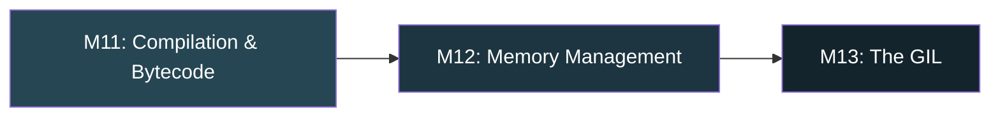

# Python — Phase 3: Under the Hood (CPython Internals)

> **Modules 11–13** | Compilation & Bytecode → Memory Management → The GIL
> **Goal:** Understand what happens when you hit "Run" — from source code to machine execution.

---

## Module 11: CPython Internals — Compilation & Bytecode

> `[ ]` — Notes will be filled in as we cover this

### 🔑 Core Idea

*(pending — `.pyc` files, `dis` module, bytecode instructions, `code` objects, compilation pipeline)*

### 💡 Key Concepts

*(pending — AST → bytecode → PVM, `compile()`, peephole optimizer, `__pycache__`)*

### 🧠 Mental Model

*(pending — source → tokens → AST → bytecode → execution pipeline diagram)*

### ⚠️ Don't Forget

*(pending — `.pyc` invalidation, `PYTHONDONTWRITEBYTECODE`, constant folding)*

### 🎯 Must-Know for Interview

*(pending)*

### 📎 Quick Code Snippet

*(pending)*

---

## Module 12: Memory Management

> `[ ]` — Notes will be filled in as we cover this

### 🔑 Core Idea

*(pending — reference counting, generational GC, `gc` module, memory leaks, `__del__` pitfalls)*

### 💡 Key Concepts

*(pending — `pymalloc` arena allocator, gen-0/1/2 thresholds, weak references, reference cycles)*

### 🧠 Mental Model

*(pending — memory hierarchy diagram: OS → pymalloc arenas → pools → blocks)*

### ⚠️ Don't Forget

*(pending — `__del__` prevents GC of cycles, `weakref` for caches, `tracemalloc` for debugging)*

### 🎯 Must-Know for Interview

*(pending)*

### 📎 Quick Code Snippet

*(pending)*

---

## Module 13: The GIL (Global Interpreter Lock)

> `[ ]` — Notes will be filled in as we cover this

### 🔑 Core Idea

*(pending — what it is, why it exists, what it does/doesn't protect, implications for concurrency)*

### 💡 Key Concepts

*(pending — GIL release during I/O, CPU-bound vs I/O-bound, `sys.getswitchinterval()`, C extensions & GIL)*

### 🧠 Mental Model

*(pending — GIL acquisition timeline diagram for threads)*

### ⚠️ Don't Forget

*(pending — GIL doesn't make your code thread-safe, `+=` is not atomic, PEP 703 free-threaded Python)*

### 🎯 Must-Know for Interview

*(pending)*

### 📎 Quick Code Snippet

*(pending)*

---

## Phase 3 — Interview Quick-Fire

*(Will be compiled after all 3 modules are covered)*

---

## Phase 3 — Key Gotchas Rapid Fire

*(Will be compiled after all 3 modules are covered)*
