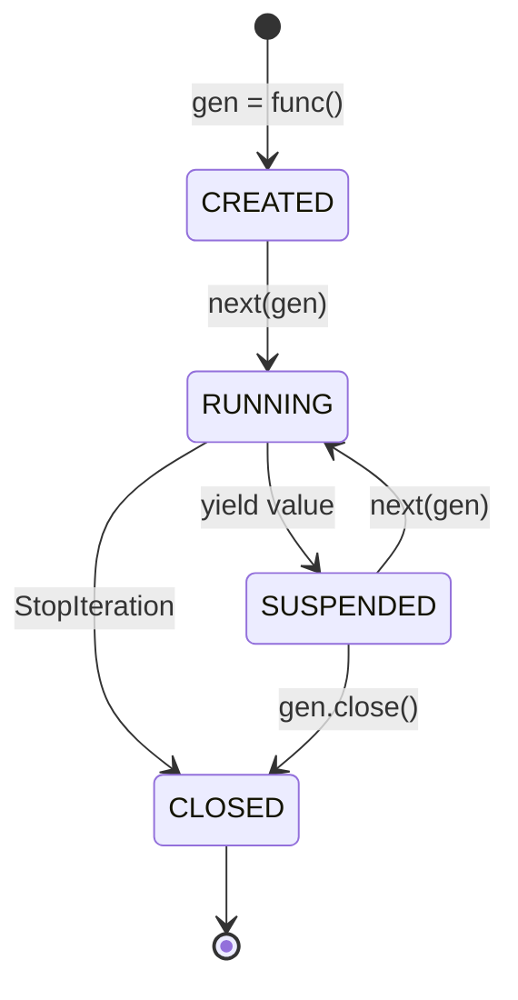
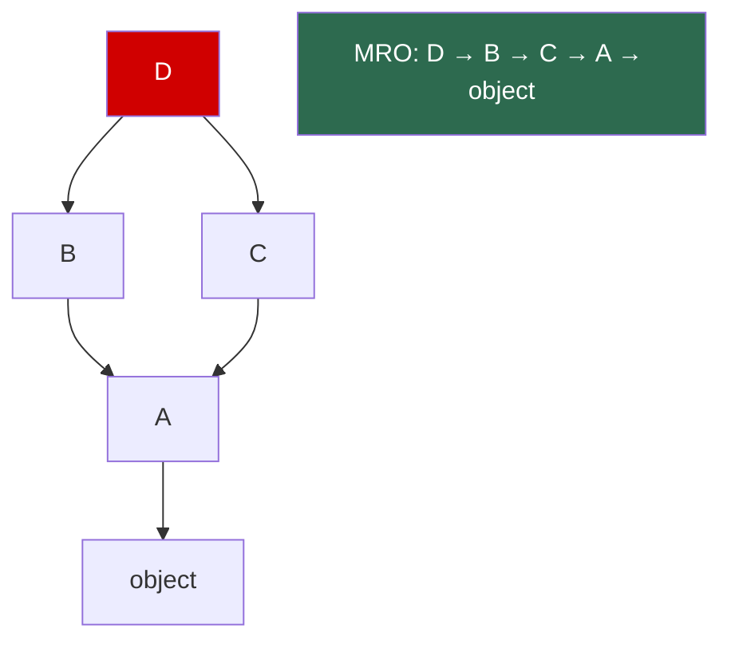

# Python — Phase 2: The Mechanics

> **Modules 6–10** | Iterators & Generators → Decorators → OOP → Error Handling → Comprehensions
> **Goal:** Master the core language features that separate juniors from seniors.


---

## Module 6: Iterators & Generators

> `[x]` — Completed

### 🔑 Core Idea

Any object with `__iter__()` is **iterable**. Any object with `__iter__()` + `__next__()` is an **iterator**. `for` loops call `iter()` then `next()` until `StopIteration`. Generators are functions with `yield` — they create iterators automatically.

### 💡 Key Concepts

**Iterator protocol:**
```python
# What `for x in nums` actually does:
iterator = iter(nums)        # calls __iter__()
while True:
    try:
        x = next(iterator)   # calls __next__()
    except StopIteration:
        break
```

**Generator lifecycle:**



**Lazy vs Eager:**

| Approach | Memory | Reusable? |
|----------|--------|-----------|
| List comp `[...]` | O(n) | ✅ Yes |
| Generator expr `(...)` | **O(1)** | ❌ Single-use |

### 🧠 Mental Model

Generator = **paused function**. `yield` freezes entire local state. `next()` unfreezes. Like pausing a movie.

**Generator pipeline pattern** — chain generators for O(1) memory stream processing:
```python
lines = read_file("50gb.log")      # generator — no I/O yet
errors = filter_errors(lines)       # generator — no filtering yet
timestamps = extract_ts(errors)     # generator — no extraction yet
for ts in timestamps:               # NOW runs — one line at a time
    print(ts)
```

### ⚠️ Don't Forget

- Generators are **single-use** — `list(gen)` twice = second is empty
- `yield from subgen` delegates to sub-generator (propagates send/throw/close)
- `.send(value)` enables two-way communication (rare in modern code)
- `return` in generator = `StopIteration` with value

### 🎯 Must-Know for Interview

- Iterator protocol: `__iter__` + `__next__` + `StopIteration`
- Generator = function with `yield`, creates iterator automatically
- Generator expression for O(1) memory on large datasets
- Pipeline pattern for stream processing
- Single-use exhaustion trap

### 📎 Quick Code Snippet

```python
# Generator for infinite sequence
def fibonacci():
    a, b = 0, 1
    while True:
        yield a
        a, b = b, a + b

from itertools import islice
list(islice(fibonacci(), 10))  # [0, 1, 1, 2, 3, 5, 8, 13, 21, 34]
```

---

## Module 7: Decorators

> `[x]` — Completed

### 🔑 Core Idea

A decorator takes a function and returns a modified function. `@decorator` is syntactic sugar for `func = decorator(func)`.

### 💡 Key Concepts

**Basic decorator:**
```python
import functools

def timer(func):
    @functools.wraps(func)         # preserves __name__, __doc__
    def wrapper(*args, **kwargs):
        start = time.time()
        result = func(*args, **kwargs)
        print(f"{func.__name__}: {time.time() - start:.3f}s")
        return result
    return wrapper
```

**Decorator factory (decorator with arguments):**
```python
def retry(max_attempts=3):          # factory returns decorator
    def decorator(func):            # actual decorator
        @functools.wraps(func)
        def wrapper(*args, **kwargs):
            for attempt in range(max_attempts):
                try:
                    return func(*args, **kwargs)
                except Exception:
                    if attempt == max_attempts - 1:
                        raise
        return wrapper
    return decorator

@retry(max_attempts=5)              # retry(5) → decorator → decorator(func)
def call_api(): pass
```

**Stacking order:**
```python
@A
@B
@C
def func(): pass
# = A(B(C(func)))
# Execution: A's wrapper → B's wrapper → C's wrapper → func
```

### 🧠 Mental Model

Decorator = Russian nesting doll. Each layer wraps the previous one. Outermost executes first.

### ⚠️ Don't Forget

- **Always `@functools.wraps(func)`** — without it, `__name__`, `__doc__` are lost
- Decorator with args = 3 levels of nesting (factory → decorator → wrapper)
- Class decorators exist — take a class, return modified class

### 🎯 Must-Know for Interview

- `@dec` = `f = dec(f)` — it's just a function call
- `@functools.wraps` is non-negotiable
- Decorator factory pattern for parametrized decorators
- Stack order: bottom applied first, outer executes first

### 📎 Quick Code Snippet

```python
# Singleton via class decorator
def singleton(cls):
    instances = {}
    @functools.wraps(cls, updated=())
    def get_instance(*args, **kwargs):
        if cls not in instances:
            instances[cls] = cls(*args, **kwargs)
        return instances[cls]
    return get_instance

@singleton
class Database: pass
Database() is Database()    # True
```

---

## Module 8: OOP in Python

> `[x]` — Completed

### 🔑 Core Idea

Python OOP has unique features: C3 linearization for MRO, `super()` follows MRO not parent, descriptors power `@property`, and `__slots__` optimizes memory.

### 💡 Key Concepts

**`__init__` vs `__new__`:**

| Method | Purpose | Override when |
|--------|---------|---------------|
| `__new__` | **Creates** instance | Singletons, immutable subclasses |
| `__init__` | **Initializes** instance | Always — set up attributes |

**MRO (C3 Linearization):**
```python
class D(B, C):  pass
# D.__mro__ = (D, B, C, A, object)
# super() in B calls C, NOT A — follows MRO!
```



**`__slots__`:**

| | Default | `__slots__` |
|---|---------|-------------|
| Memory | `__dict__` per instance | ~40% less |
| Dynamic attrs | ✅ `obj.x = 1` | ❌ AttributeError |
| Use when | Flexibility | Millions of instances |

**Attribute lookup order:**
1. Data descriptor (class) → has `__get__` + `__set__`
2. Instance `__dict__`
3. Non-data descriptor (class) → has `__get__` only
4. `__getattr__()` fallback

### 🧠 Mental Model

`super()` ≠ "call parent." `super()` = "call next in MRO." In diamond inheritance, B's `super()` can call C (sibling), not A (parent).

### ⚠️ Don't Forget

- `super()` follows MRO, not class hierarchy — critical in diamond inheritance
- `__slots__` blocks `__dict__` — no dynamic attributes
- Defining `__eq__` without `__hash__` → unhashable (from Module 3)
- `@property` is just a data descriptor under the hood

### 🎯 Must-Know for Interview

- MRO = C3 linearization, check with `Class.__mro__`
- `super()` follows MRO — explain with diamond example
- `__slots__` for memory optimization of millions of instances
- Descriptor protocol powers `@property`, `@classmethod`, `@staticmethod`

### 📎 Quick Code Snippet

```python
# MRO in action
class A:
    def method(self): print("A")
class B(A):
    def method(self):
        print("B")
        super().method()    # calls C, not A!
class C(A):
    def method(self):
        print("C")
        super().method()
class D(B, C):
    def method(self):
        print("D")
        super().method()

D().method()    # D → B → C → A (follows MRO)
```

---

## Module 9: Error Handling & Context Managers

> `[x]` — Completed

### 🔑 Core Idea

Catch `Exception`, never bare `except` or `BaseException`. Context managers (`with`) guarantee cleanup via `__enter__`/`__exit__`.

### 💡 Key Concepts

**Exception hierarchy (what matters):**
```
BaseException          ← NEVER catch this
├── SystemExit         ← sys.exit() — let it exit!
├── KeyboardInterrupt  ← Ctrl+C — let it interrupt!
└── Exception          ← CATCH THIS ONE
    ├── ValueError, TypeError, KeyError, ...
```

**`try/except/else/finally`:**
```python
try:
    result = operation()
except ValueError as e:     # specific error
    handle_error(e)
else:                        # runs ONLY if no exception
    save(result)
finally:                     # ALWAYS runs (cleanup)
    close_connection()
```

**Context manager shortcut:**
```python
from contextlib import contextmanager

@contextmanager
def timer(label):
    start = time.time()
    yield                   # before yield = __enter__, after = __exit__
    print(f"{label}: {time.time() - start:.3f}s")
```

### 🧠 Mental Model

`BaseException` = nuclear. `Exception` = normal errors. Bare `except:` catches nuclear → process becomes unkillable.

### ⚠️ Don't Forget

- Bare `except:` catches `KeyboardInterrupt` + `SystemExit` — **EVIL**
- `__exit__` returning `True` **suppresses** the exception — use with extreme caution
- Exception chaining: `raise X from Y` preserves original cause in traceback
- `else` block runs only when no exception — use for success-path logic

### 🎯 Must-Know for Interview

- Always `except Exception`, never bare `except`
- `try/except/else/finally` — know when each block runs
- `contextlib.contextmanager` — generator-based context manager
- Exception chaining with `from` keyword

### 📎 Quick Code Snippet

```python
# Custom exception with context
class APIError(Exception):
    def __init__(self, status_code, message):
        self.status_code = status_code
        super().__init__(f"HTTP {status_code}: {message}")

# Exception chaining
try:
    data = json.loads(raw)
except json.JSONDecodeError as e:
    raise APIError(400, "Invalid JSON") from e
```

---

## Module 10: Comprehensions & Functional Tools

> `[x]` — Completed

### 🔑 Core Idea

Comprehensions are concise loops. `functools` provides higher-order function utilities. `itertools` provides iterator building blocks.

### 💡 Key Concepts

**Four comprehension types:**
```python
[x**2 for x in range(10)]              # list
{w: len(w) for w in words}             # dict
{len(w) for w in words}                # set
(x**2 for x in range(10))              # generator (lazy)
```

**`functools` essentials:**

| Tool | Purpose | Gotcha |
|------|---------|--------|
| `lru_cache(maxsize)` | Memoization | Args must be **hashable** |
| `partial(func, *args)` | Freeze arguments | Creates new callable |
| `reduce(func, iterable)` | Fold/accumulate | Import from functools |
| `wraps(func)` | Preserve metadata in decorators | Always use |

**`itertools` top 5:**
```python
chain([1,2], [3,4])           # flatten: [1,2,3,4]
islice(range(100), 5, 10)     # slice any iterator: [5,6,7,8,9]
groupby(data, key=func)       # group consecutive (MUST be pre-sorted!)
product("AB", "12")           # cartesian product
combinations("ABC", 2)        # all 2-combos: AB, AC, BC
```

### 🧠 Mental Model

Nested comprehension = read left-to-right = for loops top-to-bottom:
```python
[num for row in matrix for num in row]
# ≡ for row in matrix:
#       for num in row:
#           append num
```

### ⚠️ Don't Forget

- `lru_cache` requires **hashable args** — `list` input → `TypeError`
- `groupby` requires **pre-sorted input** — unsorted = wrong groups
- Generator expressions are **single-use**
- `lru_cache` holds references → can cause memory leaks with large objects

### 🎯 Must-Know for Interview

- All four comprehension types + when to use generator vs list
- `lru_cache` for memoization — hashable args requirement
- `itertools.chain`, `islice`, `groupby` — know behavior and gotchas
- Nested comprehension reading order

### 📎 Quick Code Snippet

```python
from functools import lru_cache

@lru_cache(maxsize=256)
def fibonacci(n):
    if n < 2: return n
    return fibonacci(n-1) + fibonacci(n-2)

fibonacci(100)                    # instant
fibonacci.cache_info()            # hits, misses, size
fibonacci.cache_clear()           # flush
```

---

## Phase 2 — Interview Quick-Fire

- **"What's a decorator?"** → Function that takes a function and returns a modified function. `@dec` = `f = dec(f)`.
- **"Explain MRO"** → C3 linearization. `super()` follows MRO, not parent. Check with `Class.__mro__`.
- **"Iterator vs iterable?"** → Iterable has `__iter__`. Iterator has `__iter__` + `__next__`. All iterators are iterable, not vice versa.
- **"Why use generators?"** → Lazy evaluation, O(1) memory for large datasets, pipeline pattern.
- **"bare except problem?"** → Catches `BaseException` including `Ctrl+C` and `sys.exit`. Process becomes unkillable. Use `except Exception`.
- **"lru_cache on a function taking a list?"** → `TypeError` — list is unhashable. Convert to tuple.
- **"What does `__slots__` do?"** → Replaces per-instance `__dict__` with fixed slots. ~40% memory savings. No dynamic attributes.
- **"Decorator with arguments?"** → Decorator factory: outer function takes args, returns the actual decorator.
- **"`yield from` vs `yield`?"** → `yield from` delegates to sub-iterator, propagates send/throw/close.
- **"`groupby` gotcha?"** → Input must be pre-sorted by the grouping key, otherwise produces wrong groups.

---

## Phase 2 — Key Gotchas Rapid Fire

1. Missing `@functools.wraps` → decorated function loses `__name__`, `__doc__`
2. Generators are single-use — second iteration yields nothing
3. `super()` follows MRO, not parent class — diamond inheritance trap
4. Bare `except:` catches `KeyboardInterrupt` → process unkillable
5. `__exit__` returning `True` silently suppresses exceptions
6. `lru_cache` args must be hashable — lists, dicts → `TypeError`
7. `groupby` requires pre-sorted input
8. `__slots__` breaks `__dict__` — no dynamic attributes
9. Defining `__eq__` without `__hash__` → unhashable class
10. Decorator factory = 3 nesting levels (factory → decorator → wrapper)
