# ⚡ Python — Speed Revision Sheet

> **Purpose:** Night-before-the-interview rapid revision. You've already learned the concepts — this is pure recall.
> **Time:** ~20 minutes to scan everything.

---

## 🗺️ Full Curriculum Map

---

## Phase 1 — Foundation (M1–M5)

### 🖼️ Object Model — Everything Is an Object

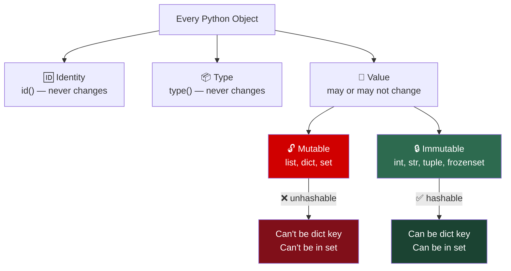

- `is` = identity (same `id()`) | `==` = equality (`__eq__`)
- **Only `is` for:** `None`, `True`, `False`
- Integer cache: `[-5, 256]` — CPython-specific, never rely on it

### 🖼️ Variables & Memory — Labels, Not Boxes

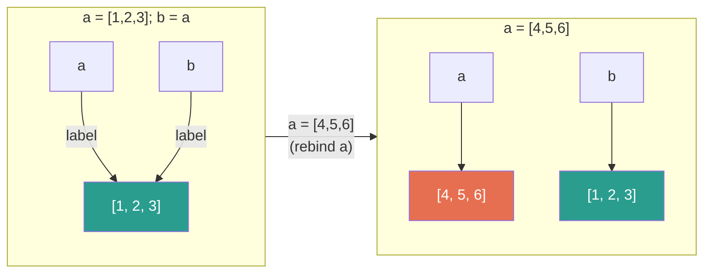

- `=` never copies — just moves a label
- **Ref counting:** refcount 0 → immediately freed
- `del` deletes the **name**, not the object
- **Pass-by-object-reference:** mutate → visible. Rebind → invisible.

### 🖼️ Copy Model

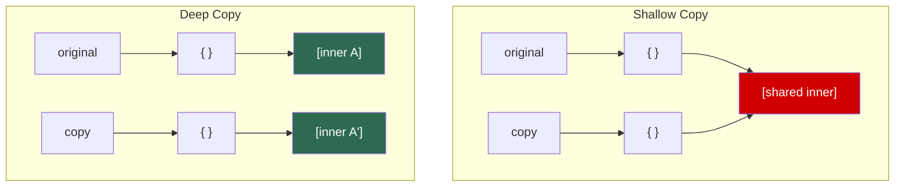

| Method | Copies | Use for |
|--------|--------|---------|
| `=` | Nothing (new label) | Shared state |
| `.copy()` / `copy.copy()` | Top-level only | Flat structures |
| `copy.deepcopy()` | Everything recursively | Nested structures |

### 🖼️ Data Structures — Internals at a Glance

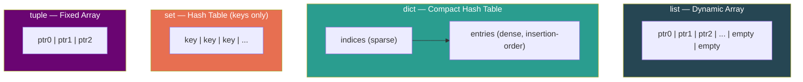

| Structure | `append` | `insert(0)` | `x in` | Ordered? | Mutable? |
|-----------|----------|-------------|--------|----------|----------|
| `list` | O(1) | **O(n)** | O(n) | ✅ | ✅ |
| `dict` | O(1) | — | **O(1)** | ✅ 3.7+ | ✅ |
| `set` | O(1) | — | **O(1)** | ❌ | ✅ |
| `tuple` | — | — | O(n) | ✅ | ❌ |

### Strings & Unicode
- `str` = code points | `bytes` = raw bytes
- **`"".join(list)` = O(n). `+=` in loop = O(n²).**
- UTF-8: ASCII=1B, CJK=3B, emoji=4B
- One emoji → entire string upgrades to 4 bytes/char (PEP 393)

### 🖼️ LEGB Scope Chain

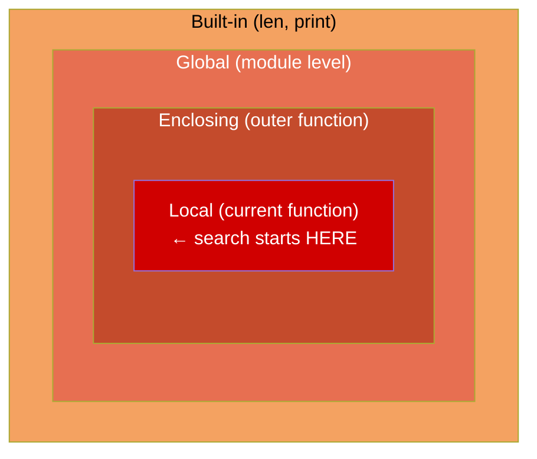

- Assignment anywhere in body → local for **entire** function → `UnboundLocalError`
- **Closures capture VARIABLES, not values** → fix: `lambda i=i: i`
- Defaults evaluated **once at definition** → `None` sentinel

---

## Phase 2 — Mechanics (M6–M10)

### 🖼️ Generator Lifecycle

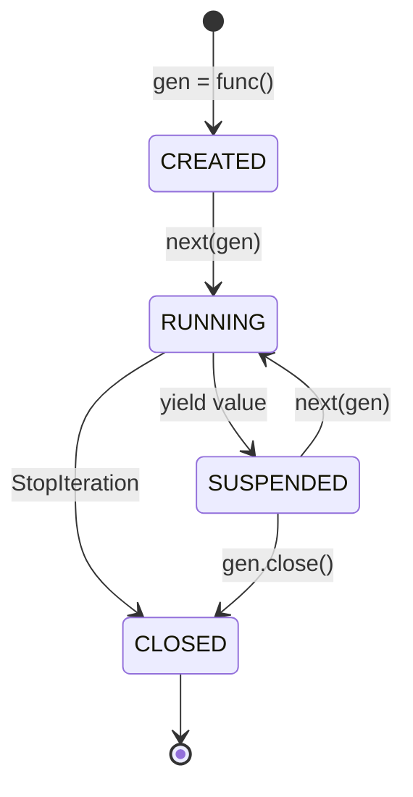

- Generator expression `(...)` → **O(1) memory, single-use**
- Generators are **permanently dead** after exhaustion

### 🖼️ Decorator Mental Model

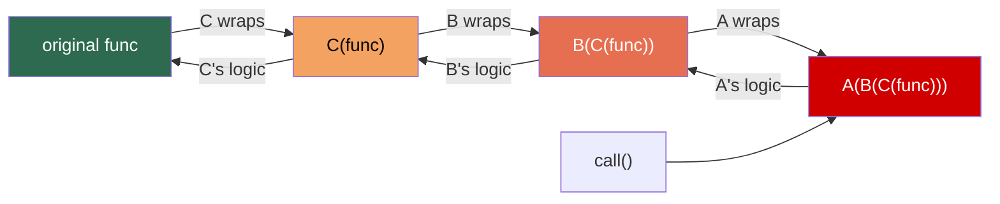

`@A @B @C def f` → `A(B(C(f)))`. **Always `@functools.wraps(func)`.**

### 🖼️ MRO — Diamond Inheritance

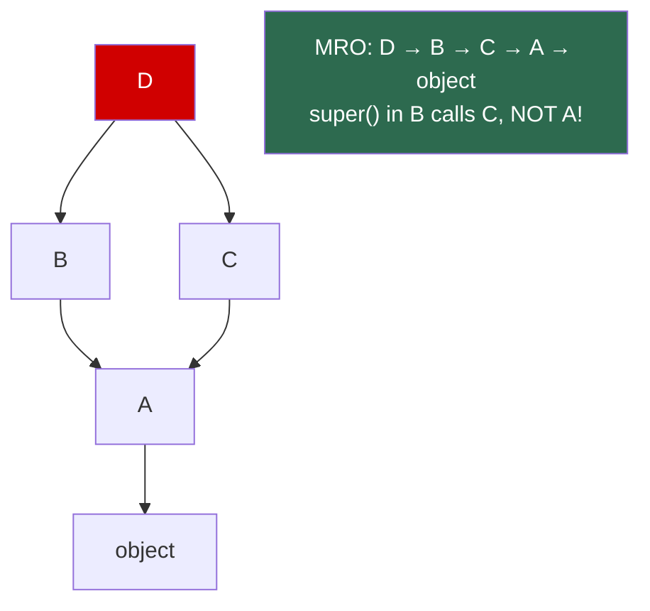

### 🖼️ `__eq__` / `__hash__` Contract

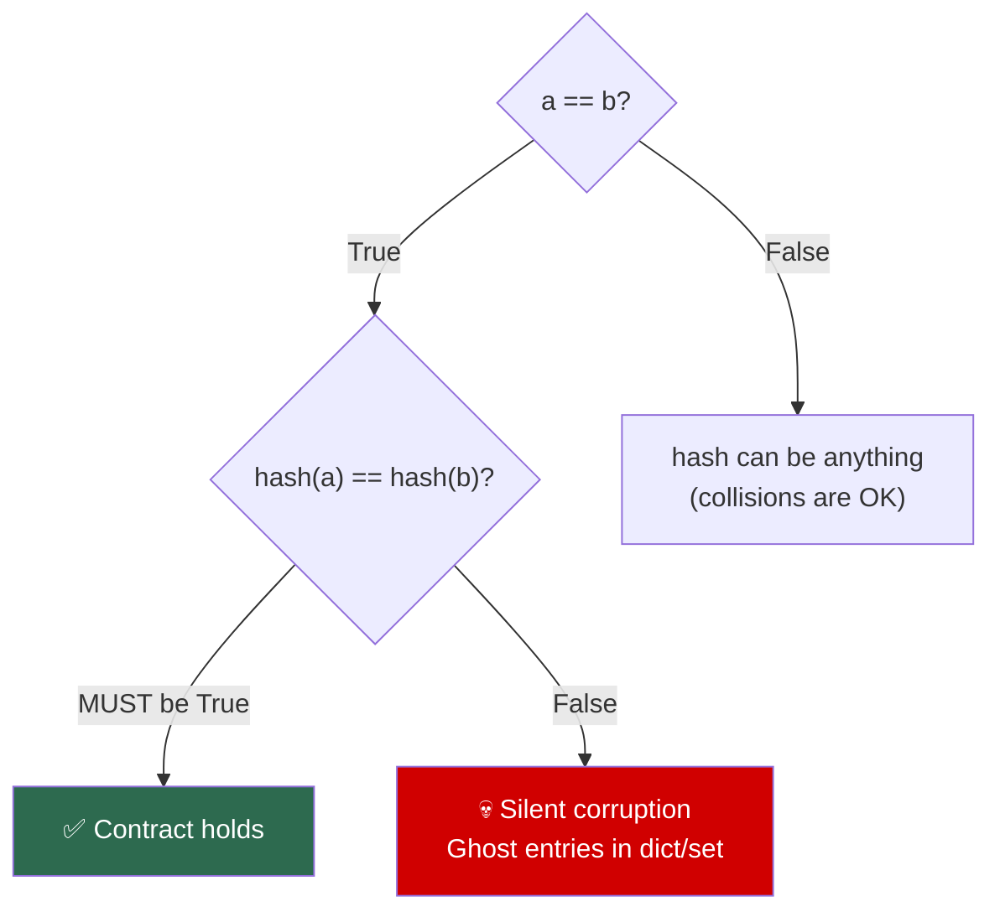

- Return `NotImplemented`, not `False`, for unknown types
- **Truthiness:** `__bool__()` → `__len__()` → `True`
- `@dataclass(frozen=True)` → auto correct `__eq__` + `__hash__`

### 🖼️ Exception Hierarchy

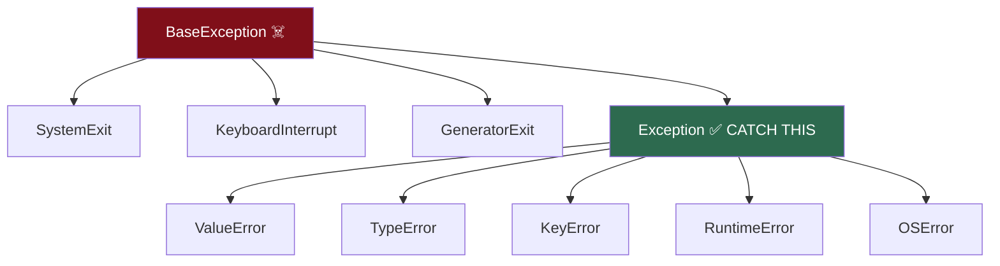

**Never bare `except:`** — catches `KeyboardInterrupt` → unkillable process.

---

## Phase 3 — CPython Internals (M11–M13)

### 🖼️ Compilation Pipeline

### 🖼️ Memory Management — Two Mechanisms

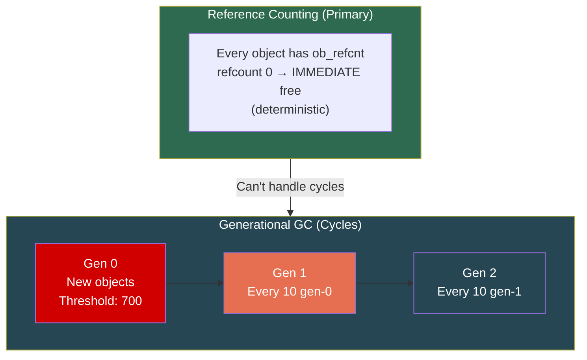

### 🖼️ GIL — One Microphone Room

```mermaid
gantt
    title GIL Thread Switching (5ms intervals)
    dateFormat X
    axisFormat %s

    section Thread 1
    Execute    :a1, 0, 5
    Wait       :a2, 5, 10
    Execute    :a3, 10, 15

    section Thread 2
    Wait       :b1, 0, 5
    Execute    :b2, 5, 10
    Wait       :b3, 10, 15
```

- GIL protects **CPython internals**, NOT your data
- **`counter += 1` = 3 bytecode ops** → needs `Lock`
- **Released during I/O** → threading works for I/O-bound

---

## Phase 4 — Concurrency (M14–M16)

### 🖼️ Concurrency Decision Framework

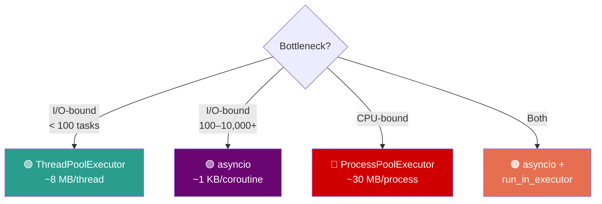

### 🖼️ Comparison

| | Threading | Multiprocessing | Asyncio |
|---|-----------|-----------------|---------|
| **Type** | Preemptive | True parallel | Cooperative |
| **GIL** | Blocked (CPU) | Own GIL ✅ | N/A (1 thread) |
| **Memory** | ~8 MB | ~30 MB | **~1 KB** |
| **Best for** | I/O, <100 | CPU-bound | I/O, 100–10K+ |
| **Switch** | OS | OS | `await` (you) |
| **Shared state** | Yes (need Lock) | No (need IPC) | Yes (no locks*) |

*single-threaded asyncio = no preemption between `await` points

---

## Phase 5 — Production (M17–M20)

### 🖼️ Import System

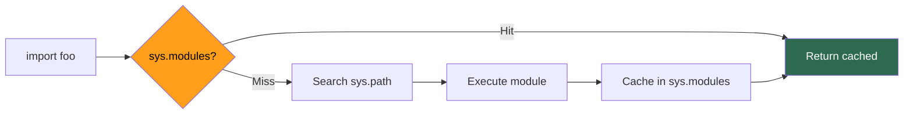

### 🖼️ Test Pyramid

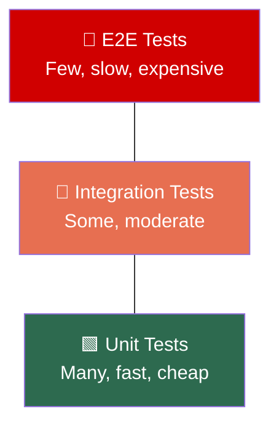

- **Mock where imported, not defined**
- Fixture scopes: `function → class → module → session`

### 🖼️ Optimization Hierarchy

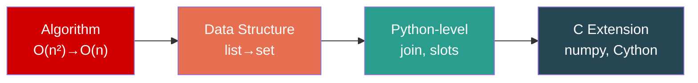

---

## Phase 6 — Design & Architecture (M21–M22)

### 🖼️ Java Pattern → Python Way

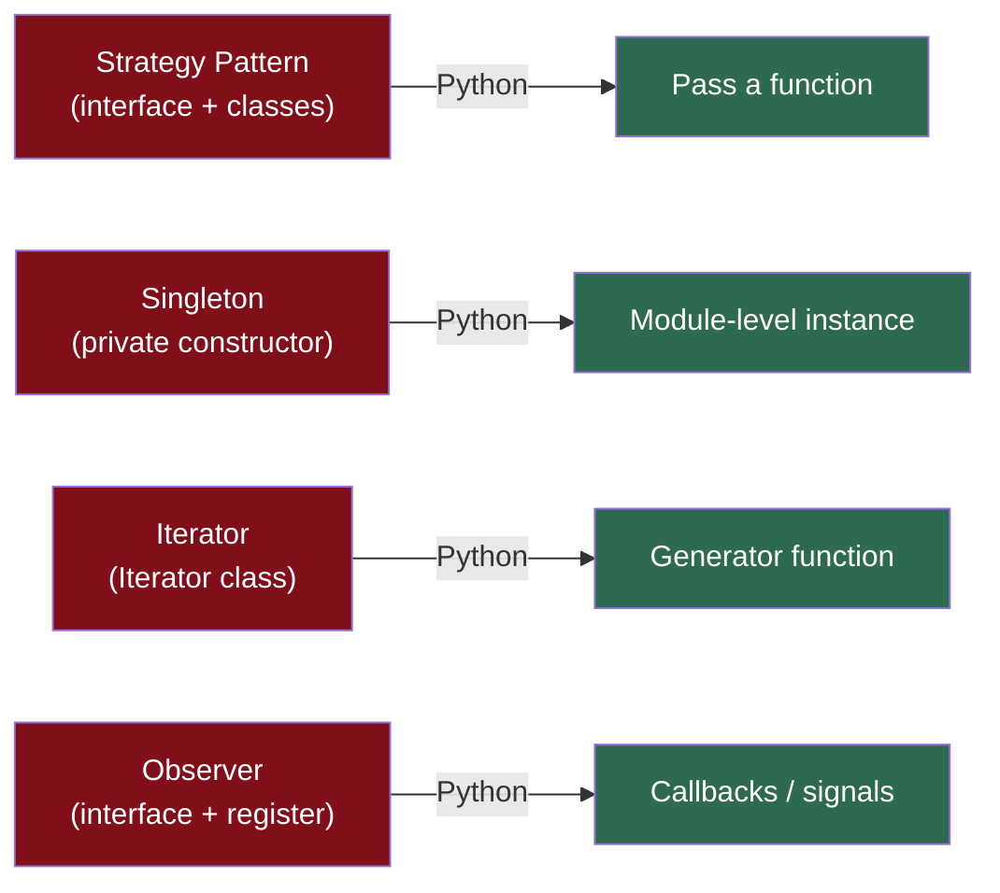

### 🖼️ Python Web Stack

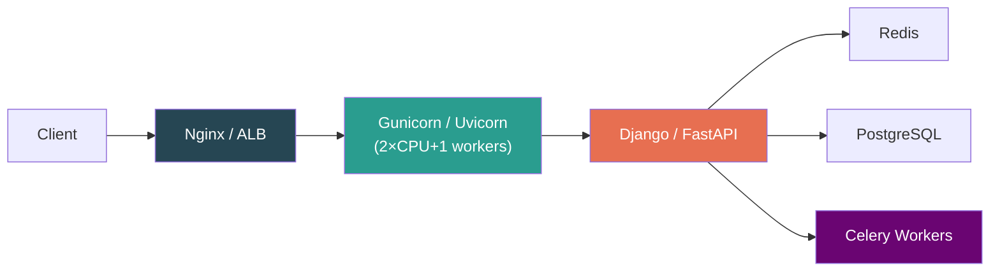

- WSGI (sync) vs ASGI (async) — Gunicorn workers = **processes** (own GIL)
- Celery tasks: **idempotent** + JSON-serializable

---

## 🔢 Key Numbers

| Item | Value |
|------|-------|
| Integer cache | `[-5, 256]` |
| `getrefcount()` overhead | +1 |
| GC thresholds | `(700, 10, 10)` |
| GIL switch interval | 5 ms |
| pymalloc limit | ≤512 bytes |
| Thread stack | ~8 MB |
| Process overhead | ~30 MB |
| Coroutine overhead | ~1 KB |
| Dict resize load factor | ~2/3 |
| Gunicorn workers | `(2 × CPU) + 1` |
| `lru_cache` default max | 128 |
| Max recursion depth | ~1000 |

---

## 💀 Top 20 Gotchas

1. `is` for values → wrong. Only for `None`/`True`/`False`
2. Integer cache `[-5, 256]` → CPython-specific
3. Mutable default `def f(x=[])` → shared across calls
4. `+=` on list = in-place. `+=` on tuple = new object
5. `del` deletes name, not object
6. Pass-by-object-reference ≠ pass-by-reference
7. `list.pop(0)` → O(n). Use `deque`
8. `defaultdict` inserts on read
9. String `+=` in loop → O(n²)
10. `len(str)` ≠ `len(bytes)` for non-ASCII
11. Generators are single-use
12. Late binding closures → `lambda i=i: i`
13. `@functools.wraps` is non-negotiable
14. `super()` follows MRO, not parent
15. Bare `except:` catches `KeyboardInterrupt`
16. `lru_cache` needs hashable args
17. `counter += 1` is NOT thread-safe
18. GIL protects CPython, NOT your code
19. `fork` + threads = deadlocks
20. Mock where it's imported, not defined

---

## 🎯 Top 15 Interview One-Liners

1. **"Pass by reference?"** → No. Pass-by-object-reference. Mutate=visible, rebind=invisible.
2. **"`is` vs `==`?"** → `is` = identity. `==` = equality. Only `is None`.
3. **"Dicts ordered?"** → Yes, insertion-ordered since 3.7 (language guarantee).
4. **"What's a closure?"** → Function capturing enclosing variables. Late binding — captures variable, not value.
5. **"Iterator vs iterable?"** → Iterable has `__iter__`. Iterator adds `__next__`. All iterators are iterable.
6. **"What's the GIL?"** → Mutex. One thread executes bytecode. Released during I/O.
7. **"`x += 1` thread-safe?"** → No. 3 bytecode ops. Use `Lock`.
8. **"Threading vs multiprocessing?"** → Threading = I/O-bound. Multiprocessing = CPU-bound.
9. **"asyncio vs threading?"** → Asyncio for 100+ concurrent I/O. 1KB/coroutine vs 8MB/thread.
10. **"Type hints runtime?"** → Zero effect. Only mypy/IDE.
11. **"Singleton in Python?"** → Module-level instance. Modules are singletons.
12. **"Memory management?"** → Refcounting (primary) + generational GC (cycles).
13. **"String concat in loop?"** → O(n²). Use `"".join()` → O(n).
14. **"`__eq__`/`__hash__` contract?"** → `a==b` → `hash(a)==hash(b)`. Violation = silent dict/set corruption.
15. **"Mutable default arg?"** → Evaluated once at definition. Fix: `None` sentinel.
