# Python — Interview Revision Notes (Index)

> **Scope:** SDE2/SDE3-level mastery — from object model to production architecture.
> **22 Modules** across **6 Phases**. Each phase has its own dedicated file.

```mermaid
flowchart TD
    subgraph P1["📂 Phase 1: The Foundation"]
        M1["M1: Object Model"]
        M2["M2: Variables & Memory"]
        M3["M3: Data Structures"]
        M4["M4: Strings & Unicode"]
        M5["M5: Functions & Scoping"]
    end
    subgraph P2["📂 Phase 2: The Mechanics"]
        M6["M6: Iterators & Generators"]
        M7["M7: Decorators"]
        M8["M8: OOP"]
        M9["M9: Error Handling & Context Managers"]
        M10["M10: Comprehensions & Functional Tools"]
    end
    subgraph P3["📂 Phase 3: CPython Internals"]
        M11["M11: Compilation & Bytecode"]
        M12["M12: Memory Management"]
        M13["M13: The GIL"]
    end
    subgraph P4["📂 Phase 4: Concurrency & Parallelism"]
        M14["M14: Threading"]
        M15["M15: Multiprocessing"]
        M16["M16: Asyncio"]
    end
    subgraph P5["📂 Phase 5: Production Python"]
        M17["M17: Modules, Packages & Imports"]
        M18["M18: Type Hints & Static Analysis"]
        M19["M19: Testing"]
        M20["M20: Performance & Profiling"]
    end
    subgraph P6["📂 Phase 6: Design & Architecture"]
        M21["M21: Design Patterns"]
        M22["M22: System Design with Python"]
    end

    P1 --> P2 --> P3 --> P4 --> P5 --> P6

    style P1 fill:#d00000,color:#fff
    style P2 fill:#e76f51,color:#fff
    style P3 fill:#264653,color:#fff
    style P4 fill:#2a9d8f,color:#fff
    style P5 fill:#6a0572,color:#fff
    style P6 fill:#1a535c,color:#fff
```



---

## Phase Files

| # | Phase | File | Modules | Status |
|---|-------|------|---------|--------|
| 1 | **The Foundation** | `Python_Foundation.md` | M1–M5: Object Model, Variables, Data Structures, Strings, Functions | `[x]` ✅ Done |
| 2 | **The Mechanics** | `Python_Mechanics.md` | M6–M10: Iterators, Decorators, OOP, Errors, Comprehensions | `[x]` ✅ Done |
| 3 | **CPython Internals** | `Python_Internals.md` | M11–M13: Bytecode, Memory Management, GIL | `[x]` ✅ Done |
| 4 | **Concurrency & Parallelism** | `Python_Concurrency.md` | M14–M16: Threading, Multiprocessing, Asyncio | `[x]` ✅ Done |
| 5 | **Production Python** | `Python_Production.md` | M17–M20: Imports, Type Hints, Testing, Profiling | `[x]` ✅ Done |
| 6 | **Design & Architecture** | `Python_Design.md` | M21–M22: Design Patterns, System Design | `[x]` ✅ Done |

---

## Quick Reference — What Goes Where

```
Python/
├── Python_revision.md          ← YOU ARE HERE (index)
├── Python_Foundation.md        ← Phase 1: Object Model → Functions
├── Python_Mechanics.md         ← Phase 2: Iterators → Comprehensions
├── Python_Internals.md         ← Phase 3: Bytecode → GIL
├── Python_Concurrency.md       ← Phase 4: Threading → Asyncio
├── Python_Production.md        ← Phase 5: Imports → Profiling
└── Python_Design.md            ← Phase 6: Patterns → System Design
```
